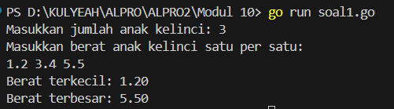
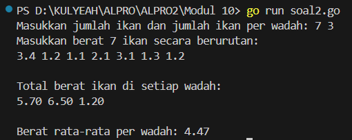
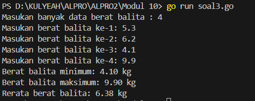

<h1 align="center">Laporan Praktikum Modul 10 <br>Nilai Ekstrim</h1>
<p align="center">SYAHLA KHEISYA MAYASTRIA - 103112430018</p>

## Dasar Teori
Dalam konteks pemrograman, **nilai ekstrem** merujuk pada:
- **Nilai minimum (terkecil)** dalam sekumpulan data
- **Nilai maksimum (terbesar)** dalam sekumpulan data
Nilai ekstrem sering digunakan untuk analisis data, seperti mencari suhu tertinggi, nilai ujian terendah, atau dalam kasus ini: berat anak kelinci yang paling ringan dan paling berat.
## Unguided

### Soal Latihan Modul 10 Nilai Ekstrim

#### Soal 1
>Sebuah program digunakan untuk mendata berat anak kelinci yang akan dijual ke pasar. Program ini menggunakan array dengan kapasitas 1000 untuk menampung data berat anak kelinci yang akan dijual. 
>**Masukan** terdiri dari sekumpulan bilangan, yang mana bilangan pertama adalah bilangan bulat N yang menyatakan banyaknya anak kelinci yang akan ditimbang beratnya. Selanjutnya N bilangan riil berikutnya adalah berat dari anak kelinci yang akan dijual. 
>**Keluaran** terdiri dari dua buah bilangan riil yang menyatakan berat kelinci terkecil dan terbesar.
```go
package main
import "fmt"
  
func main() {
    var n int
    var berat [1000]float64
    fmt.Print("Masukkan jumlah anak kelinci: ")
    fmt.Scan(&n)
  
    if n <= 0 || n > 1000 {
        fmt.Println("Jumlah anak kelinci harus antara 1 hingga 1000")
        return
    }
  
    fmt.Println("Masukkan berat anak kelinci satu per satu:")
    for i := 0; i < n; i++ {
        fmt.Scan(&berat[i])
    }
  
    min := berat[0]
    max := berat[0]
  
    for i := 1; i < n; i++ {
        if berat[i] < min {
            min = berat[i]
        }
        if berat[i] > max {
            max = berat[i]
        }
    }
  
    fmt.Printf("Berat terkecil: %.2f\n", min)
    fmt.Printf("Berat terbesar: %.2f\n", max)
}
```


Program ini digunakan untuk mencatat data berat anak kelinci yang akan dijual ke pasar. Dari data yang dimasukkan, program akan mencari dan menampilkan:
**Berat terkecil** (nilai minimum)
**Berat terbesar** (nilai maksimum)
- n adalah variabel untuk menyimpan jumlah anak kelinci.
- berat adalah array berdimensi 1000 bertipe float64 yang digunakan untuk menyimpan berat dari anak-anak kelinci tersebut.
- Meminta user untuk memasukkan berat dari masing-masing anak kelinci sebanyak `n` kali.
- Berat dimasukkan satu per satu dan disimpan ke dalam array berat
- Melakukan perulangan dari indeks ke-1 sampai ke-n untuk membandingkan semua elemen.
- Jika ditemukan elemen yang lebih kecil dari min, maka min di-update.
- Jika ditemukan elemen yang lebih besar dari max, maka max di-update.
#### Soal 2
Sebuah program digunakan untuk menentukan tarif ikan yang akan dijual ke pasar. Program ini menggunakan array dengan kapasitas 1000 untuk menampung data berat ikan yang akan dijual. **Masukan** terdiri dari dua baris, yang mana baris pertama terdiri dari dua bilangan bulat x dan y. Bilangan x menyatakan banyaknya ikan yang akan dijual, sedangkan y adalah banyaknya ikan yang akan dimasukan ke dalam wadah. Baris kedua terdiri dari sejumlah x bilangan riil yang menyatakan banyaknya ikan yang akan dijual. 
**Keluaran** terdiri dari dua baris. Baris pertama adalah kumpulan bilangan riil yang menyatakan total berat ikan di setiap wadah (jumlah wadah tergantung pada nilai x dan y, urutan ikan yang dimasukan ke dalam wadah sesuai urutan pada masukan baris ke-2). Baris kedua adalah sebuah bilangan riil yang menyatakan berat rata-rata ikan di setiap wadah.
```go
package main
import "fmt"

func main() {
    var x, y int
    var berat [1000]float64
  
    fmt.Print("Masukkan jumlah ikan dan jumlah ikan per wadah: ")
    fmt.Scan(&x, &y)

    if x <= 0 || x > 1000 || y <= 0 {
        fmt.Println("Input tidak valid.")
        return
    }

    fmt.Printf("Masukkan berat %d ikan secara berurutan:\n", x)
    for i := 0; i < x; i++ {
        fmt.Scan(&berat[i])
    }

    jumlahWadah := (x + y - 1) / y
    totalBeratPerWadah := make([]float64, jumlahWadah)

    for i := 0; i < x; i++ {
        indeksWadah := i / y
        totalBeratPerWadah[indeksWadah] += berat[i]
    }
  
    fmt.Println("\nTotal berat ikan di setiap wadah:")
    for i := 0; i < jumlahWadah; i++ {
        fmt.Printf("%.2f ", totalBeratPerWadah[i])
    }
  
    var total float64
    for i := 0; i < jumlahWadah; i++ {
        total += totalBeratPerWadah[i]
    }
    rataRata := total / float64(jumlahWadah)
    fmt.Printf("\n\nBerat rata-rata per wadah: %.2f\n", rataRata)
}
```

Program ini digunakan untuk membantu proses pendataan dan pengelompokan berat ikan yang akan dijual ke pasar. Ikan yang jumlahnya diketahui akan dibagi ke dalam beberapa wadah dengan kapasitas tertentu (jumlah ikan per wadah). Setelah dikelompokkan, program akan menghitung:
1. Total berat ikan di setiap wadah
2. Berat rata-rata dari seluruh wadah
- x = jumlah total ikan.
- y = jumlah ikan yang dimasukkan ke satu wadah
- berat = array berisi berat masing-masing ikan, maksimal 1000.
- Meminta user memasukkan dua bilangan: jumlah ikan (x) dan jumlah ikan per wadah (y).
- Memastikan jumlah ikan tidak melebihi kapasitas array dan tidak nol/negatif.
- Jika input tidak valid, program akan berhenti.
#### Soal 3
Pos Pelayanan Terpadu (posyandu) sebagai tempat pelayanan kesehatan perlu mencatat data berat balita (dalam kg). Petugas akan memasukkan data tersebut ke dalam array. Dari data yang diperoleh akan dicari berat balita terkecil, terbesar, dan reratanya.
```go
package main
import "fmt"

type arrBalita [100]float64
  
func hitungMinMax(arrBerat arrBalita, n int, bMin, bMax *float64) {
    *bMin = arrBerat[0]
    *bMax = arrBerat[0]
  
    for i := 1; i < n; i++ {
        if arrBerat[i] < *bMin {
            *bMin = arrBerat[i]
        }
        if arrBerat[i] > *bMax {
            *bMax = arrBerat[i]
        }
    }
}

func rerata(arrBerat arrBalita, n int) float64 {
    var total float64
    for i := 0; i < n; i++ {
        total += arrBerat[i]
    }
    return total / float64(n)
}
  
func main() {
    var data arrBalita
    var n int
    var min, max float64
    fmt.Print("Masukan banyak data berat balita : ")
    fmt.Scan(&n)

    if n <= 0 || n > 100 {
        fmt.Println("Jumlah data harus antara 1 sampai 100.")
        return
    }

    for i := 0; i < n; i++ {
        fmt.Printf("Masukan berat balita ke-%d: ", i+1)
        fmt.Scan(&data[i])
    }

    hitungMinMax(data, n, &min, &max)
    avg := rerata(data, n)
  
    fmt.Printf("Berat balita minimum: %.2f kg\n", min)
    fmt.Printf("Berat balita maksimum: %.2f kg\n", max)
    fmt.Printf("Rerata berat balita: %.2f kg\n", avg)
}
```

Program ini digunakan untuk membantu petugas Posyandu dalam:
Menyimpan data berat badan balita (maksimal 100 data)
Menentukan berat **terkecil** dan **terbesar** dari seluruh balita yang tercatat.
Menghitung **rata-rata** berat badan balita.
- arrBalita sebagai array yang bisa menampung hingga 100 angka desimal (float64) yang mewakili berat badan balita
- Subprogram hitungMinMax ini menerima array arrBerat dan jumlah data n, serta dua pointer untuk mengisi nilai berat minimum dan maksimum.
- Subprogram rerata ini menghitung rata-rata berat balita dalam array.
- data: untuk menyimpan berat semua balita
- n: jumlah balita.
- min, max: untuk menyimpan hasil berat minimum dan maksimum.
- User diminta memasukkan berapa balita yang akan dicatat.
- Jika input n tidak sesuai batas, program akan berhenti.


