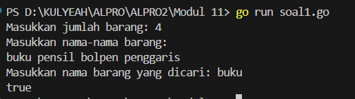
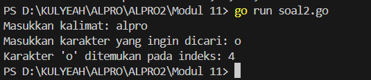
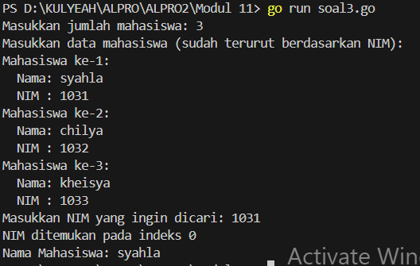
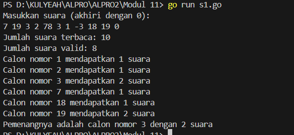
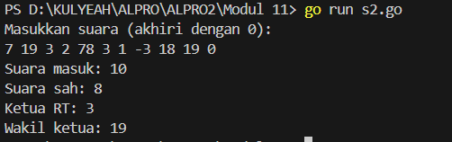
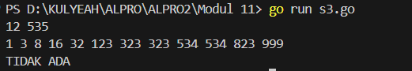

<h1 align="center">Laporan Praktikum Modul 11 <br>Nilai Acak Pada Himpunan Data</h1>
<p align="center">SYAHLA KHEISYA MAYASTRIA - 103112430018</p>

## Dasar Teori
Berbeda dengan pencarian nilai ekstrim, yang mana nilai yang dicari selalu ditemukan, maka pada kasus pencarian ini terdapat kemungkinan bahwa data yang dicari tidak ditemukan. Selain itu pada kasus pencarian ini akan diperkenal algoritma pencarian yang memanfaatkan keterurutan data. 
**Sequential Search** Pencarian secara sekuensial ini adalah pencarian yang dilakukan dari data pertama, kedua hingga terakhir secara satu persatu dan berurutan
**Binary Search** Ide algoritma adalah: (dengan asumsi data terurut dari kecil membesar (ascending), dan data dengan indeks kecil ada di "kiri" dan indeks besar ada di "kanan")
**Pencarian pada Array Bertipe Data Struct** Algoritma pencarian pada array bertipe data struct tidak berbeda jauh dengan tipe data dasar, kita hanya perlu menambahkan field kategori dari pencarian yang akan dilakukan.

## Guided
#### Soal 1
```go
package main
import "fmt"

func cariBarang(daftar []string, x string) bool {
    for _, barang := range daftar {
        if barang == x {
            return true
        }
    }
    return false
}
  
func main() {
    var n int
    fmt.Print("Masukkan jumlah barang: ")
    fmt.Scan(&n)
  
    daftarBarang := make([]string, n)
    fmt.Println("Masukkan nama-nama barang:")
    for i := 0; i < n; i++ {
        fmt.Scan(&daftarBarang[i])
    }
  
    var barangDicari string
    fmt.Print("Masukkan nama barang yang dicari: ")
    fmt.Scan(&barangDicari)

    ditemukan := cariBarang(daftarBarang, barangDicari)
    fmt.Println(ditemukan)
}
```


Program Go di atas bertujuan untuk **mencari apakah suatu barang ada dalam daftar** barang yang dimasukkan oleh pengguna:
Fungsi akan mengecek satu per satu isi dari slice daftar. Jika ditemukan elemen yang sama dengan x, maka fungsi akan mengembalikan nilai true. Jika sudah dicek semua namun tidak ditemukan, fungsi akan mengembalikan false.
#### Soal 2
```go
package main

import (
    "bufio"
    "fmt"
    "os"
    "strings"
)

func printPositions(karakter string, posisi []int) {
    if len(posisi) > 0 {
        fmt.Printf("Karakter '%s' ditemukan pada indeks: %s\n", karakter, strings.Trim(strings.Join(strings.Fields(fmt.Sprint(posisi)), ","), "[]"))
    } else {
        fmt.Printf("Karakter '%s' tidak ditemukan dalam kalimat.\n", karakter)
    }
}

func main() {
    var karakter string
    reader := bufio.NewReader(os.Stdin)

    fmt.Print("Masukkan kalimat: ")
    kalimat, _ := reader.ReadString('\n')
    kalimat = strings.TrimSpace(kalimat)

    fmt.Print("Masukkan karakter yang ingin dicari: ")
    fmt.Scanln(&karakter)

    if len(karakter) != 1 {
        fmt.Println("Harap masukkan satu karakter saja.")
        return
    }

    var posisi []int
    for i, c := range kalimat {
        if string(c) == karakter {
            posisi = append(posisi, i)
        }
    }
    printPositions(karakter, posisi)
}
```

Program ini dibuat untuk **mencari semua posisi (indeks)** dari sebuah karakter yang dimasukkan oleh pengguna, dalam suatu kalimat. Program akan mencetak indeks-indeks di mana karakter tersebut muncul. 
Fungsi printPositions  ini bertugas untuk menampilkan hasil pencarian karakter:
- Jika karakter ditemukan, maka mencetak semua indeks di mana karakter tersebut muncul.
- Jika tidak ditemukan, maka mencetak pesan bahwa karakter tidak ditemukan.
Menggunakan bufio.NewReader agar input bisa menerima kalimat lengkap, termasuk spasi.    
TrimSpace digunakan untuk menghapus newline atau spasi berlebih di akhir.
#### Soal 3
```go
package main
import "fmt"

type Mahasiswa struct {
    Nama string
    NIM  string
}

func binarySearch(mahasiswa []Mahasiswa, target string) int {
    low := 0
    high := len(mahasiswa) - 1
    for low <= high {
        mid := (low + high) / 2
        if mahasiswa[mid].NIM == target {
            return mid
        } else if mahasiswa[mid].NIM < target {
            low = mid + 1
        } else {
            high = mid - 1
        }
    }
    return -1
}

func main() {
    var n int
    fmt.Print("Masukkan jumlah mahasiswa: ")
    fmt.Scanln(&n)
    mahasiswa := make([]Mahasiswa, n)

    fmt.Println("Masukkan data mahasiswa (sudah terurut berdasarkan NIM):")
    for i := 0; i < n; i++ {
        fmt.Printf("Mahasiswa ke-%d:\n", i+1)
        fmt.Print("  Nama: ")
        fmt.Scanln(&mahasiswa[i].Nama)
        fmt.Print("  NIM : ")
        fmt.Scanln(&mahasiswa[i].NIM)
    }
    var cariNIM string
    fmt.Print("Masukkan NIM yang ingin dicari: ")
    fmt.Scanln(&cariNIM)
    indeks := binarySearch(mahasiswa, cariNIM)

    if indeks != -1 {
        fmt.Printf("NIM ditemukan pada indeks %d\n", indeks)
        fmt.Printf("Nama Mahasiswa: %s\n", mahasiswa[indeks].Nama)
    } else {
        fmt.Println("NIM tidak ditemukan.")
    }
}
```

Program ini digunakan untuk mencari data mahasiswa berdasarkan **NIM** menggunakan metode **Binary Search**.
Fungsi binarySearch ini digunakan untuk mencari NIM mahasiswa menggunakan algoritma pencarian biner, yang sangat efisien untuk data yang sudah terurut.
## Unguided

### Soal Latihan Modul 10 Nilai Ekstrim

#### Soal 1
>Pada pemilihan ketua RT yang baru saja berlangsung, terdapat 20 calon ketua yang bertanding memperebutkan suara warga. Perhitungan suara dapat segera dilakukan karena warga cukup mengisi formulir dengan nomor dari calon ketua RT yang dipilihnya. Seperti biasa, selalu ada pengisian yang tidak tepat atau dengan nomor pilihan di luar yang tersedia, sehingga data juga harus divalidasi. Tugas Anda untuk membuat program mencari siapa yang memenangkan pemilihan ketua RT. Buatlah program pilkart yang akan membaca, memvalidasi, dan menghitung suara yang diberikan dalam pemilihan ketua RT tersebut. 
>Masukan hanya satu baris data saja, berisi bilangan bulat valid yang kadang tersisipi dengan data tidak valid. Data valid adalah integer dengan nilai di antara 1 s.d. 20 (inklusif). Data berakhir jika ditemukan sebuah bilangan dengan nilai 0. 
>Keluaran dimulai dengan baris berisi jumlah data suara yang terbaca, diikuti baris yang berisi berapa banyak suara yang valid. Kemudian sejumlah baris yang mencetak data para calon apa saja yang mendapatkan suara.
```go
package main
import "fmt"

func main() {
    var input int
    var totalSuara int
    var suaraValid int
    
    suara := make([]int, 21)
    fmt.Println("Masukkan suara (akhiri dengan 0):")
    for {
        fmt.Scan(&input)
        if input == 0 {
            break
        }
        totalSuara++
        if input >= 1 && input <= 20 {
            suara[input]++
            suaraValid++
        }
    }
    pemenang := 0
    jumlahSuaraTerbanyak := 0
    for i := 1; i <= 20; i++ {
        if suara[i] > jumlahSuaraTerbanyak {
            jumlahSuaraTerbanyak = suara[i]
            pemenang = i
        }
    }
    fmt.Println("Jumlah suara terbaca:", totalSuara)
    fmt.Println("Jumlah suara valid:", suaraValid)
    for i := 1; i <= 20; i++ {
        if suara[i] > 0 {
            fmt.Printf("Calon nomor %d mendapatkan %d suara\n", i, suara[i])
        }
    }

    if pemenang != 0 {
        fmt.Printf("Pemenangnya adalah calon nomor %d dengan %d suara\n", pemenang, jumlahSuaraTerbanyak)
    } else {
        fmt.Println("Tidak ada pemenang karena tidak ada suara valid.")
    }
}
```


Program ini dibuat untuk menghitung hasil pemilihan ketua RT dari 20 calon yang tersedia. Pengguna memasukkan angka-angka yang mewakili pilihan suara, dan input dihentikan dengan angka 0. Program kemudian memvalidasi suara: hanya angka 1 sampai 20 yang dianggap sah.
Setelah semua suara dibaca, program menampilkan total suara yang masuk, jumlah suara yang valid, serta jumlah suara yang diterima oleh masing-masing calon. Di akhir, program menentukan calon dengan suara terbanyak sebagai pemenangnya. Jika tidak ada suara valid, maka tidak ada pemenang yang diumumkan.
#### Soal 2
) Berdasarkan program sebelumnya, buat program pilkart yang mencari siapa pemenang pemilihan ketua RT. Sekaligus juga ditentukan bahwa wakil ketua RT adalah calon yang mendapatkan suara terbanyak kedua. Jika beberapa calon mendapatkan suara terbanyak yang sama, ketua terpilih adalah dengan nomor peserta yang paling kecil dan wakilnya dengan nomor peserta terkecil berikutnya. 
Masukan hanya satu baris data saja, berisi bilangan bulat valid yang kadang tersisipi dengan data tidak valid. Data valid adalah bilangan bulat dengan nilai di antara 1 s.d. 20 (inklusif). Data berakhir jika ditemukan sebuah bilangan dengan nilai 0. 
Keluaran dimulai dengan baris berisi jumlah data suara yang terbaca, diikuti baris yang berisi berapa banyak suara yang valid. Kemudian tercetak calon nomor berapa saja yang menjadi pasangan ketua RT dan wakil ketua RT yang baru.
```go
package main
import "fmt"

func main() {
    var input int
    var totalSuara int
    var suaraSah int
    suara := make([]int, 21)

    fmt.Println("Masukkan suara (akhiri dengan 0):")
    for {
        fmt.Scan(&input)
        if input == 0 {
            break
        }
        totalSuara++
        if input >= 1 && input <= 20 {
            suara[input]++
            suaraSah++
        }
    }

    ketua := 0
    wakil := 0

    for i := 1; i <= 20; i++ {
        if suara[i] > suara[ketua] || (suara[i] == suara[ketua] && i < ketua) {
            wakil = ketua
            ketua = i
        } else if (suara[i] > suara[wakil] || (suara[i] == suara[wakil] && i < wakil)) && i != ketua {
            wakil = i
        }
    }
    fmt.Printf("Suara masuk: %d\n", totalSuara)
    fmt.Printf("Suara sah: %d\n", suaraSah)
    if suaraSah == 0 {
        fmt.Println("Tidak ada suara sah.")
    } else {
        fmt.Printf("Ketua RT: %d\n", ketua)
        if suara[wakil] > 0 {
            fmt.Printf("Wakil ketua: %d\n", wakil)
        } else {
            fmt.Println("Wakil ketua: tidak ada.")
        }
    }
}
```

Program digunakan untuk menyelesaikan soal pemilihan ketua RT **dengan penentuan ketua dan wakil ketua RT** berdasarkan suara terbanyak dan nomor calon terkecil jika terjadi suara yang sama
Suara dimasukkan berupa angka 1–20 (sah), dan berhenti saat angka 0 dimasukkan. Program mencatat jumlah total suara dan suara sah, lalu menentukan ketua RT sebagai calon dengan suara terbanyak, dan wakilnya adalah calon dengan suara terbanyak kedua. Jika ada jumlah suara yang sama, calon dengan nomor lebih kecil dipilih. Hasil akhirnya menampilkan total suara masuk, suara sah, serta nomor calon ketua dan wakil ketua terpilih.
#### Soal 3
Diberikan n data integer positif dalam keadaan terurut membesar dan sebuah integer lain k, apakah bilangan k tersebut ada dalam daftar bilangan yang diberikan? Jika ya, berikan indeksnya, jika tidak sebutkan "TIDAK ADA". 
Masukan terdiri dari dua baris. Baris pertama berisi dua buah integer positif, yaitu n dan k. n menyatakan banyaknya data, dimana 1 < n <= 1000000. k adalah bilangan yang ingin dicari. Baris kedua berisi n buah data integer positif yang sudah terurut membesar. 
Keluaran terdiri dari satu baris saja, yaitu sebuah bilangan yang menyatakan posisi data yang dicari (k) dalam kumpulan data yang diberikan. Posisi data dihitung dimulai dari angka 0. Atau memberikan keluaran "TIDAK ADA" jika data k tersebut tidak ditemukan dalam kumpulan. Program yang dibangun harus menggunakan subprogram dengan mengikuti kerangka yang sudah diberikan berikut ini.
```go
package main
import "fmt"

func binarySearch(data []int, k int) int {
    low := 0
    high := len(data) - 1

    for low <= high {
        mid := (low + high) / 2
        if data[mid] == k {
            return mid
        } else if data[mid] < k {
            low = mid + 1
        } else {
            high = mid - 1
        }
    }
    return -1
}

func main() {
    var n, k int
    fmt.Scan(&n, &k)

    data := make([]int, n)
    for i := 0; i < n; i++ {
        fmt.Scan(&data[i])
    }
    posisi := binarySearch(data, k)
    if posisi != -1 {
        fmt.Println(posisi)
    } else {
        fmt.Println("TIDAK ADA")
    }
}
```

Program ini digunakan untuk mencari apakah suatu bilangan k ada dalam daftar bilangan data yang **sudah terurut membesar** menggunakan metode **binary search**. Jika ditemukan, akan ditampilkan indeks dari bilangan tersebut. Jika tidak, akan ditampilkan "TIDAK ADA".


