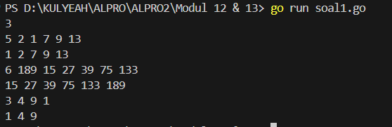

<h1 align="center">Laporan Praktikum Modul 12 & 13 <br>Pengurutan Data</h1>
<p align="center">SYAHLA KHEISYA MAYASTRIA - 103112430018</p>

## Dasar Teori
**Ide Algoritma Selection Sort**
Pengurutan secara seleksi ini idenya adalah mencari nilai ekstrim pada sekumpulan data, kemudian meletakkan pada posisi yang seharusnya. Pada penjelasan berikut ini data akan diurut membesar (ascending), dan data dengan indeks kecil ada di "kiri" dan indeks besar ada di "kanan". 1)Cari nilai terkecil di dalam rentang data tersisa 
2)Pindahkan/tukar tempat dengan data yang berada pada posisi paling kiri pada rentang data tersisa tersebut. 
3)Ulangi proses ini sampai tersisa hanya satu data saja.
**Ide Algoritma Insertion Sort**
Pengurutan secara insertion ini idenya adalah menyisipkan suatu nilai pada posisi yang seharusnya. Pada penjelasan berikut ini data akan diurut mengecil (descending), dan data dengan indeks kecil ada di "kiri" dan indeks besar ada di "kanan". 
1)Untuk satu data yang belum terurut dan sejumlah data yang sudah diurutkan: Geser data yang sudah terurut tersebut (ke kanan), sehingga ada satu ruang kosong untuk memasukkan data yang belum terurut ke dalam data yang sudah terurut dan tetap menjaga keterurutan. 
2)Ulangi proses tersebut untuk setiap data yang belum terurut terhadap rangkaian data yang sudah terurut.

## Guided
#### Soal 1
Urut Ganjil Genap
Diberikan `n` bilangan bulat positif. Buat program untuk mengurutkan angka ganjil secara **membesar (ascending)** dan angka genap secara **mengecil (descending)**, lalu gabungkan hasilnya dengan ganjil duluan.
Gunakan **selection sort** dalam proses pengurutan.
**Masukan:**
- Baris pertama berisi bilangan bulat `n` (1 ≤ n ≤ 100).
- Baris kedua berisi `n` bilangan bulat positif.
**Keluaran:**
- Satu baris berisi angka ganjil terurut membesar diikuti angka genap terurut mengecil.
**Contoh Masukan:**
```
10
12 7 3 2 9 6 8 1 11 4
```
**Contoh Keluaran:**
```
1 3 7 9 11 12 8 6 4 2
```

```go
package main
import "fmt"

func selectionSortAsc(arr []int, panjang int) {
	var temp, i, j, idxMin int
		for i = 0; i < panjang-1; i++ {
		idxMin = i
		for j = i + 1; j < panjang; j++ {
			if arr[j] < arr[idxMin] {
				idxMin = j
			}
		}
		temp = arr[idxMin]
		arr[idxMin] = arr[i]
		arr[i] = temp
	}
}

func selectionSortDesc(arr []int, panjang int) {
	var temp, i, j, idxMax int
	for i = 0; i < panjang-1; i++ {
		idxMax = i
		for j = i + 1; j < panjang; j++ {
			if arr[j] > arr[idxMax] {
				idxMax = j
			}
		}
		temp = arr[idxMax]
		arr[idxMax] = arr[i]
		arr[i] = temp
	}
}

func main() {
	n := 10
	numbers := []int{12, 7, 3, 2, 9, 6, 8, 1, 11, 4}

	var ganjil []int
	var genap []int

	for i := 0; i < n; i++ {
		if numbers[i]%2 == 1 {
			ganjil = append(ganjil, numbers[i])
		} else {
			genap = append(genap, numbers[i])
		}
	}

	selectionSortAsc(ganjil, len(ganjil))
	selectionSortDesc(genap, len(genap))

	for i := 0; i < len(ganjil); i++ {
		fmt.Print(ganjil[i], " ")
	}
	for i := 0; i < len(genap); i++ {
		fmt.Print(genap[i], " ")
	}
}
```


Program ini ditulis dalam bahasa Go dan bertujuan untuk memisahkan angka-angka dalam sebuah array menjadi dua kelompok: bilangan ganjil dan bilangan genap. Setelah dipisahkan, bilangan ganjil akan diurutkan dari yang terkecil ke yang terbesar (ascending), sedangkan bilangan genap akan diurutkan dari yang terbesar ke yang terkecil (descending). Proses pengurutan dilakukan dengan algoritma selection sort
Fungsi `selectionSortAsc`
- Mengurutkan array arr secara ascending dengan metode selection sort
- idxMin menyimpan indeks dari elemen terkecil selama iterasi
- Elemen terkecil ditukar dengan elemen di posisi sekarang (i)
Fungsi `selectionSortDesc`
- Mengurutkan secara descending
- idxMax menyimpan indeks dari elemen terbesar selama iterasi.
#### Soal 2
Ranking Nilai Ujian
Sebuah kelas memiliki sejumlah siswa yang telah mengikuti ujian. Tugas Anda adalah membuat program yang membaca nilai-nilai ujian siswa dengan struct berisikan `nim` dan `nilai`, lalu mengurutkannya dari yang tertinggi ke yang terendah menggunakan **insertion sort**.
**Masukan:**
- Baris pertama adalah sebuah bilangan bulat `n` (1 ≤ n ≤ 100), menyatakan jumlah siswa.
- Baris berikutnya berisi `n` bilangan bulat yang masing-masing adalah nilai ujian (0–100).
**Keluaran:**
- Satu baris berisi nilai-nilai yang sudah terurut dari terbesar ke terkecil.
**Contoh Masukan:**
```
6
75 60 90 80 100 65
```
**Contoh Keluaran:**
```
100 90 80 75 65 60
```

```go
package main
import "fmt"

type identitas struct {
    nama  string
    nilai int
}

func nilaiujian(arr []identitas) {
    var temp identitas
    for i := 1; i < len(arr); i++ {
        temp = arr[i]
        j := i
        
        for j > 0 && temp.nilai > arr[j-1].nilai {
            arr[j] = arr[j-1]
            j--
        }

        arr[j] = temp
    }
}

func main() {
    orang := []identitas{
        {"Farrel Spakbor", 75},
        {"Yunan Tung Tung Sahur", 90},
        {"Faiz Bakso", 85},
        {"Abyan Lumpia Boom", 95},
        {"Icikiwir", 80},
    }
    nilaiujian(orang)
    for i := 0; i < len(orang); i++ {
        fmt.Println(orang[i].nama, ": ", orang[i].nilai)
    }
}
```

Program ini digunakan untuk **mengurutkan data siswa berdasarkan nilai ujian**, dari **yang tertinggi ke yang terendah**, lalu menampilkan nama dan nilainya satu per satu.
Fungsi `nilaiujian()`
Fungsi ini mengurutkan slice (daftar) siswa berdasarkan nilai ujian, dari yang **paling tinggi ke paling rendah**, menggunakan **insertion sort**.

## Unguided

### Soal Latihan Modul 12 & 13

#### Soal 1
>Hercules, preman terkenal seantero ibukota, memiliki kerabat di banyak daerah. Tentunya Hercules sangat suka mengunjungi semua kerabatnya itu. Diberikan masukan nomor rumah dari semua kerabatnya di suatu daerah, buatlah program rumahkerabat yang akan menyusun nomor-nomor rumah kerabatnya secara terurut membesar menggunakan algoritma selection sort. Masukan dimulai dengan sebuah integer 𝒏 (0 < n < 1000), banyaknya daerah kerabat Hercules tinggal. Isi 𝒏 baris berikutnya selalu dimulai dengan sebuah integer 𝒎 (0 < m < 1000000) yang menyatakan banyaknya rumah kerabat di daerah tersebut, diikuti dengan rangkaian bilangan bulat positif, nomor rumah para kerabat. 
>Keluaran terdiri dari n baris, yaitu rangkaian rumah kerabatnya terurut membesar di masing masing daerah.
```go
package main
import "fmt"

func selectionSort(arr []int) {
    n := len(arr)
    for i := 0; i < n-1; i++ {
        minIndex := i
        for j := i + 1; j < n; j++ {
            if arr[j] < arr[minIndex] {
                minIndex = j
            }
        }
        arr[i], arr[minIndex] = arr[minIndex], arr[i]
    }
}
func main() {
    var n int
    fmt.Scan(&n)
    for i := 0; i < n; i++ {
        var m int
        fmt.Scan(&m)

        rumah := make([]int, m)
        for j := 0; j < m; j++ {
            fmt.Scan(&rumah[j])
        }

        selectionSort(rumah)
        for j := 0; j < m; j++ {
            fmt.Printf("%d ", rumah[j])
        }
        fmt.Println()
    }
}
```

Program ini digunakan untuk mengurutkan beberapa kumpulan data angka menggunakan algoritma _selection sort_
Fungsi `selectionSort`
Fungsi ini melakukan Selection Sort, yaitu algoritma pengurutan yang bekerja dengan cara:
    1. Mencari elemen terkecil dari sisa array.    
    2. Menukarnya ke posisi yang sesuai (ke depan).
arr[i], arr[minIndex] = arr[minIndex], arr[i]: Menukar elemen saat ditemukan nilai terkecil yang baru.
#### Soal 2
Belakangan diketahui ternyata Hercules itu tidak berani menyeberang jalan, maka selalu diusahakan agar hanya menyeberang jalan sesedikit mungkin, hanya diujung jalan. Karena nomor rumah sisi kiri jalan selalu ganjil dan sisi kanan jalan selalu genap, maka buatlah program kerabat dekat yang akan menampilkan nomor rumah mulai dari nomor yang ganjil lebih dulu terurut membesar dan kemudian menampilkan nomor rumah dengan nomor genap terurut mengecil. Format Masukan masih persis sama seperti sebelumnya. 
Keluaran terdiri dari n baris, yaitu rangkaian rumah kerabatnya terurut membesar untuk nomor ganjil, diikuti dengan terurut mengecil untuk nomor genap, di masing-masing daerah.
```go
package main
import "fmt"

func selectionSortDesc(arr []int) {
    n := len(arr)
    for i := 0; i < n-1; i++ {
        maxIdx := i
        for j := i + 1; j < n; j++ {
            if arr[j] > arr[maxIdx] {
                maxIdx = j
            }
        }
        arr[i], arr[maxIdx] = arr[maxIdx], arr[i]
    }
}

func selectionSortAsc(arr []int) {
    n := len(arr)
    for i := 0; i < n-1; i++ {
        minIdx := i
        for j := i + 1; j < n; j++ {
            if arr[j] < arr[minIdx] {
                minIdx = j
            }
        }
        arr[i], arr[minIdx] = arr[minIdx], arr[i]
    }
}

func main() {
    var n int
    fmt.Scan(&n)

    for i := 0; i < n; i++ {
        var m int
        fmt.Scan(&m)

        var genap []int
        var ganjil []int

        for j := 0; j < m; j++ {
            var nomor int
            fmt.Scan(&nomor)
            if nomor%2 == 0 {
                genap = append(genap, nomor)
            } else {
                ganjil = append(ganjil, nomor)
            }
        }
        selectionSortDesc(genap)
        selectionSortAsc(ganjil)
        
        for _, g := range genap {
            fmt.Printf("%d ", g)
        }
        for _, j := range ganjil {
            fmt.Printf("%d ", j)
        }
        fmt.Println()
    }
}
```

Program ini bertujuan untuk **memisahkan angka genap dan ganjil**, kemudian:
- Mengurutkan angka genap secara menurun (descending)
- Mengurutkan angka ganjil secara menaik (ascending) Lalu mencetak hasil pengurutan tersebut dalam satu baris.
Fungsi `selectionSortDesc`
Mengurutkan slice arr dari besar ke kecil (descending).
Gunakan selection sort: mencari nilai terbesar, lalu menukar ke posisi yang sesuai.
Fungsi `selectionSortAsc`
Mengurutkan slice arr dari kecil ke besar (ascending).
Mirip dengan fungsi sebelumnya, hanya bedanya menggunakan perbandingan <

#### Soal 3
Kompetisi pemrograman yang baru saja berlalu diikuti oleh 17 tim dari berbagai perguruan tinggi ternama. Dalam kompetisi tersebut, setiap tim berlomba untuk menyelesaikan sebanyak mungkin problem yang diberikan. Dari 13 problem yang diberikan, ada satu problem yang menarik. Problem tersebut mudah dipahami, hampir semua tim mencoba untuk menyelesaikannya, tetapi hanya 3 tim yang berhasil. Apa sih problemnya? "Median adalah nilai tengah dari suatu koleksi data yang sudah terurut. Jika jumlah data genap, maka nilai median adalah rerata dari kedua nilai tengahnya. Pada problem ini, semua data merupakan bilangan bulat positif, dan karenanya rerata nilai tengah dibulatkan ke bawah." Buatlah program median yang mencetak nilai median terhadap seluruh data yang sudah terbaca, jika data yang dibaca saat itu adalah 0. 
Masukan berbentuk rangkaian bilangan bulat. Masukan tidak akan berisi lebih dari 1000000 data, tidak termasuk bilangan 0. Data 0 merupakan tanda bahwa median harus dicetak, tidak termasuk data yang dicari mediannya. Data masukan diakhiri dengan bilangan bulat -5313. 
Keluaran adalah median yang diminta, satu data per baris.
```go
package main

import (
    "bufio"
    "fmt"
    "os"
    "sort"
    "strconv"
)

func median(data []int) int {
    sort.Ints(data)
    n := len(data)
    if n == 0 {
        return 0
    }
    if n%2 == 1 {
        return data[n/2]
    }
    return (data[n/2-1] + data[n/2]) / 2
}

func main() {
    scanner := bufio.NewScanner(os.Stdin)
    scanner.Split(bufio.ScanWords)

    var data []int

    for scanner.Scan() {
        word := scanner.Text()
        num, err := strconv.Atoi(word)
        if err != nil {
            continue
        }

        if num == -5313 {
            break
        } else if num == 0 {
            fmt.Println(median(data))
        } else if num > 0 {
            data = append(data, num)
        }
    }
}
```

Program ini berfungsi untuk membaca sekumpulan angka dari input dan menyimpan angka-angka tersebut ke dalam sebuah daftar.  
Setiap kali angka `0` dimasukkan, program akan mencetak **median** dari daftar angka yang sudah dikumpulkan sejauh itu. Program akan berhenti jika menemukan angka khusus `-5313`.
Fungsi `median(data []int) int`
Menerima slice berisi data angka
Mengurutkan slice dengan sort.Ints(data)   
Menghitung median:
    - Jika jumlah data ganjil → ambil elemen tengah (data`[n/2]`)
    - Jika genap → ambil rata-rata dari dua elemen tengah

#### Soal 4
Buatlah sebuah program yang digunakan untuk membaca data integer seperti contoh yang diberikan di bawah ini, kemudian diurutkan (menggunakan metoda insertion sort), dan memeriksa apakah data yang terurut berjarak sama terhadap data sebelumnya. 
Masukan terdiri dari sekumpulan bilangan bulat yang diakhiri oleh bilangan negatif. Hanya bilangan non negatif saja yang disimpan ke dalam array. 
Keluaran terdiri dari dua baris. Baris pertama adalah isi dari array setelah dilakukan pengurutan, sedangkan baris kedua adalah status jarak setiap bilangan yang ada di dalam array. "Data berjarak x" atau "data berjarak tidak tetap".
```go
package main

import (
    "bufio"
    "fmt"
    "os"
    "strconv"
)

func insertionSort(arr []int) {
    for i := 1; i < len(arr); i++ {
        key := arr[i]
        j := i - 1
        for j >= 0 && arr[j] > key {
            arr[j+1] = arr[j]
            j--
        }
        arr[j+1] = key
    }
}

func cekJarak(arr []int) (bool, int) {
    if len(arr) < 2 {
        return true, 0
    }
    jarak := arr[1] - arr[0]
    for i := 2; i < len(arr); i++ {
        if arr[i]-arr[i-1] != jarak {
            return false, 0
        }
    }
    return true, jarak
}

func main() {
    scanner := bufio.NewScanner(os.Stdin)
    scanner.Split(bufio.ScanWords)

    var data []int
  
    for scanner.Scan() {
        text := scanner.Text()
        n, err := strconv.Atoi(text)
        if err != nil {
            continue
        }
        if n < 0 {
            break
        }
        data = append(data, n)
    }
    insertionSort(data)
    for _, v := range data {
        fmt.Printf("%d ", v)
    }
    fmt.Println()
    sama, jarak := cekJarak(data)
    if sama {
        fmt.Printf("Data berjarak %d\n", jarak)
    } else {
        fmt.Println("Data berjarak tidak tetap")
    }
}
```

Program ini membaca sekumpulan bilangan bulat dari input, mengurutkannya menggunakan **insertion sort**, lalu mengecek apakah urutan bilangan tersebut memiliki **jarak tetap** (selisih antar angka yang konsisten, seperti deret aritmatika). Jika semua selisih antar elemen sama, maka program akan mencetak besar jaraknya. Jika tidak, akan mencetak bahwa jaraknya tidak tetap.
Fungsi `insertionSort`
Fungsi ini mengurutkan slice arr dari kecil ke besar menggunakan **insertion sort**.
Prosesnya: setiap elemen arr[i] dibandingkan dengan elemen-elemen sebelumnya dan disisipkan ke posisi yang sesuai agar urutan tetap menaik.
Fungsi `cekJarak`
Mengecek apakah semua elemen dalam array memiliki selisih tetap (jarak yang sama)
Misalnya: `[2, 4, 6, 8]` punya jarak tetap `2`, karena 4–2=2, 6–4=2, dst.
Jika jaraknya sama, fungsi mengembalikan true dan nilai jaraknya.
Jika tidak, mengembalikan false dan 0
#### Soal 5
Sebuah program perpustakaan digunakan untuk mengelola data buku di dalam suatu perpustakaan.
Masukan terdiri dari beberapa baris. Baris pertama adalah bilangan bulat N yang menyatakan banyaknya data buku yang ada di dalam perpustakaan. N baris berikutnya, masing-masingnya adalah data buku sesuai dengan atribut atau field pada struct. Baris terakhir adalah bilangan bulat yang menyatakan rating buku yang akan dicari. 
Keluaran terdiri dari beberapa baris. Baris pertama adalah data buku terfavorit, baris kedua adalah lima judul buku dengan rating tertinggi, selanjutnya baris terakhir adalah data buku yang dicari sesuai rating yang diberikan pada masukan baris terakhir.
```go
package main

import (
    "bufio"
    "fmt"
    "os"
    "strconv"
    "strings"
)

type Buku struct {
    id, judul, penulis, penerbit string
    eksemplar, tahun, rating     int
}
const nMax = 7919
type DaftarBuku = []Buku

func DaftarkanBuku(pustaka *DaftarBuku, n int) {
    scanner := bufio.NewScanner(os.Stdin)
    fmt.Println("Masukkan data buku sebanyak", n, "baris. Format: id;judul;penulis;penerbit;eksemplar;tahun;rating")

    for i := 0; i < n; i++ {
        scanner.Scan()
        line := scanner.Text()
        parts := strings.Split(line, ";")
        if len(parts) != 7 {
            fmt.Println("Format salah. Harus 7 kolom dipisah ;")
            i--
            continue
        }

        eksemplar, _ := strconv.Atoi(strings.TrimSpace(parts[4]))
        tahun, _ := strconv.Atoi(strings.TrimSpace(parts[5]))
        rating, _ := strconv.Atoi(strings.TrimSpace(parts[6]))

        b := Buku{
            id:        strings.TrimSpace(parts[0]),
            judul:     strings.TrimSpace(parts[1]),
            penulis:   strings.TrimSpace(parts[2]),
            penerbit:  strings.TrimSpace(parts[3]),
            eksemplar: eksemplar,
            tahun:     tahun,
            rating:    rating,
        }
        *pustaka = append(*pustaka, b)
    }
}

func CetakTerfavorit(pustaka DaftarBuku, n int) {
    if n == 0 {
        fmt.Println("Pustaka kosong.")
        return
    }

    terfavorit := pustaka[0]
    for _, b := range pustaka {
        if b.rating > terfavorit.rating {
            terfavorit = b
        }
    }

    fmt.Println("Buku Terfavorit:")
    fmt.Printf("Judul    : %s\n", terfavorit.judul)
    fmt.Printf("Penulis  : %s\n", terfavorit.penulis)
    fmt.Printf("Penerbit : %s\n", terfavorit.penerbit)
    fmt.Printf("Tahun    : %d\n", terfavorit.tahun)
}

func UrutBuku(pustaka *DaftarBuku, n int) {
    for i := 1; i < n; i++ {
        temp := (*pustaka)[i]
        j := i - 1
        for j >= 0 && (*pustaka)[j].rating < temp.rating {
            (*pustaka)[j+1] = (*pustaka)[j]
            j--
        }
        (*pustaka)[j+1] = temp
    }
}

func Cetak5Terbaru(pustaka DaftarBuku, n int) {
    fmt.Println("5 Buku dengan Rating Tertinggi:")
    jumlah := 5
    if n < 5 {
        jumlah = n
    }
    for i := 0; i < jumlah; i++ {
        fmt.Printf("%d. %s\n", i+1, pustaka[i].judul)
    }
}

func CariBuku(pustaka DaftarBuku, n int, r int) {
    low := 0
    high := n - 1
    found := false

    for low <= high {
        mid := (low + high) / 2
        if pustaka[mid].rating == r {
            b := pustaka[mid]
            fmt.Println("Buku Ditemukan:")
            fmt.Printf("Judul    : %s\n", b.judul)
            fmt.Printf("Penulis  : %s\n", b.penulis)
            fmt.Printf("Penerbit : %s\n", b.penerbit)
            fmt.Printf("Tahun    : %d\n", b.tahun)
            fmt.Printf("Eksemplar: %d\n", b.eksemplar)
            fmt.Printf("Rating   : %d\n", b.rating)
            found = true
            break
        } else if pustaka[mid].rating < r {
            high = mid - 1
        } else {
            low = mid + 1
        }
    }

    if !found {
        fmt.Println("Tidak ada buku dengan rating seperti itu.")
    }
}
  
func main() {
    var pustaka DaftarBuku
    var n int

    fmt.Print("Masukkan jumlah buku: ")
    fmt.Scanln(&n)

    DaftarkanBuku(&pustaka, n)
    CetakTerfavorit(pustaka, n)
    UrutBuku(&pustaka, n)
    Cetak5Terbaru(pustaka, n)

    var r int
    fmt.Print("Masukkan rating yang ingin dicari: ")
    fmt.Scanln(&r)
    CariBuku(pustaka, n, r)
}
```

Program ini adalah sistem manajemen data buku berbasis teks.  
Fungsinya mencakup:
1. Mendaftarkan data buku dari input pengguna
2. Menentukan buku dengan rating tertinggi
3. Mengurutkan buku berdasarkan rating tertinggi ke terendah
4. Menampilkan 5 buku dengan rating tertinggi
5. Melakukan pencarian buku berdasarkan rating dengan binary search
Fungsi `DaftarkanBuku`
Menerima input pengguna sebanyak n buku
Format input: id;judul;penulis;penerbit;eksemplar;tahun;rating
Setiap buku dikonversi ke struct dan disimpan di slice pustaka
Fungsi `CetakTerfavorit`
Mencari buku dengan rating tertinggi
Menampilkan detail buku tersebut: judul, penulis, penerbit, tahun
Fungsi `UrutBuku`
Mengurutkan seluruh buku dalam pustaka berdasarkan rating (tertinggi ke terendah) menggunakan insertion sort
Fungsi `Cetak5Terbaru`
Menampilkan judul dari 5 buku dengan rating tertinggi dari hasil pengurutan sebelumnya
Fungsi `CariBuku`
Mencari buku berdasarkan rating menggunakan binary search
Jika ditemukan tampilkan detail lengkap
Jika tidak ditemukan tampilkan pesan tidak ada


