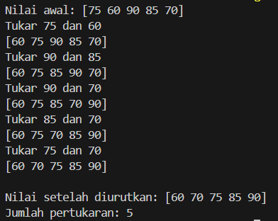
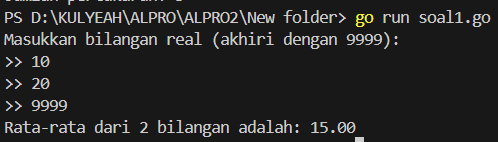
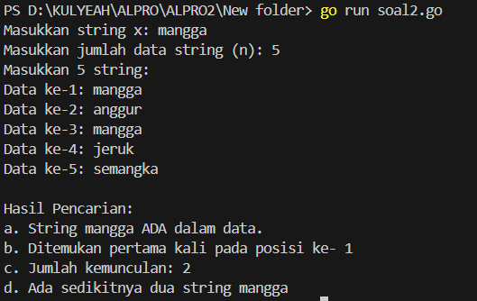
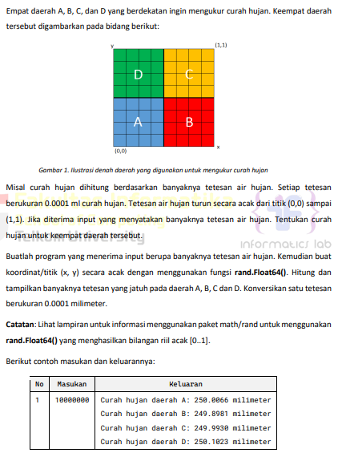
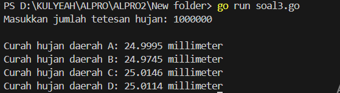
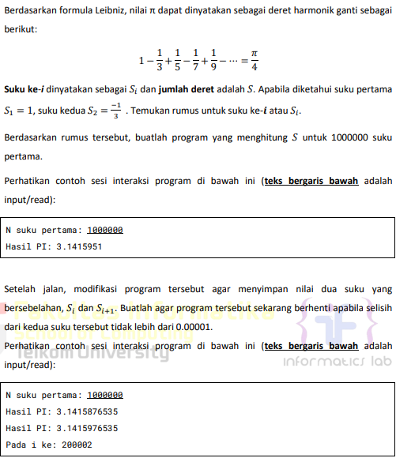
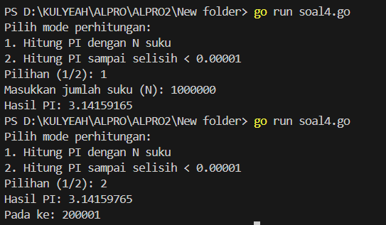
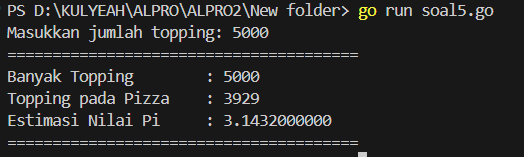

<h1 align="center">Laporan Praktikum Modul 17 <br>Skema Pemrosesan Sekuensial</h1>
<p align="center">SYAHLA KHEISYA MAYASTRIA - 103112430018</p>

## Dasar Teori
Skema pemrosesan sekuensial adalah cara eksekusi program di mana **instruksi dijalankan satu per satu secara berurutan**, dari atas ke bawah, tanpa adanya proses paralel atau pemrosesan bersamaan (concurrent).
Dalam Go, ini berarti program berjalan **dari baris pertama sampai akhir** secara **linear**, kecuali ada perintah untuk lompat seperti `if`, `for`, atau fungsi.

## Guided
#### Soal 
Aldi memiliki daftar nilai ulangan matematika temannya: 75, 60, 90, 85, dan 70. Ia ingin mengurutkan nilai tersebut dari yang terkecil ke yang terbesar menggunakan **metode Bubble Sort**.
**Pertanyaan:**
1. Tunjukkan proses pengurutan nilai menggunakan Bubble Sort **hingga semua nilai terurut.**
2. Berapa kali pertukaran (swap) terjadi dalam proses ini?

```go
package main
import "fmt"

func main() {
    nilai := []int{75, 60, 90, 85, 70}
    swapCount := 0
    
    fmt.Println("Nilai awal:", nilai)

    for i := 0; i < len(nilai)-1; i++ {
        for j := 0; j < len(nilai)-1-i; j++ {
            if nilai[j] > nilai[j+1] {
                fmt.Printf("Tukar %d dan %d\n", nilai[j], nilai[j+1])
                nilai[j], nilai[j+1] = nilai[j+1], nilai[j]
                swapCount++
                fmt.Println(nilai)
            }
        }
    }
    fmt.Println("\nNilai setelah diurutkan:", nilai)
    fmt.Println("Jumlah pertukaran:", swapCount)
}
```

Program ini berfungsi untuk **mengurutkan data nilai** dari yang terkecil ke yang terbesar menggunakan **algoritma Bubble Sort**, serta menghitung **jumlah pertukaran (swap)** yang terjadi selama proses pengurutan.

## Unguided

### Soal Latihan Modul 17

#### Soal 1
>Diberikan sejumlah bilangan real yang diakhiri dengan marker 9999, cari rerata dari bilanganbilangan tersebut.
```go
package main
import "fmt"

func main() {
    var angka float64
    var total float64
    var count int

    fmt.Println("Masukkan bilangan real (akhiri dengan 9999):")
    for {
        fmt.Print(">> ")
        fmt.Scan(&angka)
        if angka == 9999 {
            break
        }
        total += angka
        count++
    }
    if count == 0 {
        fmt.Println("Tidak ada data yang dihitung.")
    } else {
        rataRata := total / float64(count)
        fmt.Printf("Rata-rata dari %d bilangan adalah: %.2f\n", count, rataRata)
    }

}
```

Program ini digunakan untuk menghitung **rata-rata bilangan real** yang dimasukkan pengguna. Input dilakukan secara berulang dan akan berhenti jika pengguna memasukkan **9999** sebagai penanda akhir (marker). Angka 9999 tidak dihitung sebagai data. Setiap bilangan yang dimasukkan akan dijumlahkan dan dihitung jumlah datanya. Setelah proses selesai, program menghitung dan menampilkan rata-rata dari bilangan tersebut. Jika tidak ada bilangan yang dimasukkan selain 9999, program akan memberi pesan bahwa tidak ada data yang dihitung. Program ini menggunakan proses **sekuensial** dan logika **perulangan serta pengkondisian**.

#### Soal 2
Diberikan string x dan n buah string. x adalah data pertama yang dibaca, n adalah data bilangan yang dibaca kedua, dan n data berikutnya adalah data string. Buat algoritma untuk menjawab pertanyaan berikut: 
a. Apakah string x ada dalam kumpulan n data string tersebut? 
b. Pada posisi ke berapa string x tersebut ditemukan?
c. Ada berapakah string x dalam kumpulan n data string tersebut?
d. Adakah sedikitnya dua string x dalam n data string tersebut?
```go
package main
import "fmt"

func main() {
    var x string
    var n int

    fmt.Print("Masukkan string x: ")
    fmt.Scan(&x)

    fmt.Print("Masukkan jumlah data string (n): ")
    fmt.Scan(&n)
  
    data := make([]string, n)
    fmt.Println("Masukkan", n, "string:")
    for i := 0; i < n; i++ {
        fmt.Printf("Data ke-%d: ", i+1)
        fmt.Scan(&data[i])
    }
    ditemukan := false
    jumlah := 0
    posisiPertama := -1

    for i := 0; i < n; i++ {
        if data[i] == x {
            if !ditemukan {
                posisiPertama = i + 1
            }
            ditemukan = true
            jumlah++
        }
    }

    fmt.Println("\nHasil Pencarian:")
    // a. Apakah string x ada?
    if ditemukan {
        fmt.Println("a. String", x, "ADA dalam data.")
    } else {
        fmt.Println("a. String", x, "TIDAK ADA dalam data.")
    }
    // b. Posisi pertama
    if posisiPertama != -1 {
        fmt.Println("b. Ditemukan pertama kali pada posisi ke-", posisiPertama)
    } else {
        fmt.Println("b. Tidak ditemukan, jadi tidak ada posisi.")
    }
    // c. Jumlah kemunculan
    fmt.Println("c. Jumlah kemunculan:", jumlah)
    // d. Apakah muncul sedikitnya dua kali?
    if jumlah >= 2 {
        fmt.Println("d. Ada sedikitnya dua string", x)
    } else {
        fmt.Println("d. TIDAK ada sedikitnya dua string", x)
    }
}
```

Program ini digunakan untuk mencari apakah string `x` terdapat dalam `n` buah string yang dimasukkan pengguna. Setelah membaca `x` dan `n`, program menerima `n` string, lalu menghitung berapa kali `x` muncul, mencatat posisi pertama kemunculannya, dan memeriksa apakah `x` muncul sedikitnya dua kali. Program menggunakan pencarian sekuensial dan struktur perulangan serta pengkondisian
#### Soal 3

```go
package main
import (
    "fmt"
    "math/rand"
    "time"
)

func main() {
    var tetesan int
    fmt.Print("Masukkan jumlah tetesan hujan: ")
    fmt.Scan(&tetesan)

    rand.Seed(time.Now().UnixNano())
    var countA, countB, countC, countD int
    for i := 0; i < tetesan; i++ {
        x := rand.Float64()
        y := rand.Float64()
        switch {
        case x < 0.5 && y < 0.5:
            countA++
        case x >= 0.5 && y < 0.5:
            countB++
        case x < 0.5 && y >= 0.5:
            countC++
        case x >= 0.5 && y >= 0.5:
            countD++
        }
    }
    fmt.Printf("\nCurah hujan daerah A: %.4f millimeter\n", float64(countA)*0.0001)
    fmt.Printf("Curah hujan daerah B: %.4f millimeter\n", float64(countB)*0.0001)
    fmt.Printf("Curah hujan daerah C: %.4f millimeter\n", float64(countC)*0.0001)
    fmt.Printf("Curah hujan daerah D: %.4f millimeter\n", float64(countD)*0.0001)
}
```

Program ini digunakan untuk mensimulasikan tetesan hujan yang jatuh secara acak pada bidang persegi berukuran 1 × 1, yang dibagi menjadi empat wilayah: A, B, C, dan D. Setiap tetesan memiliki koordinat acak `(x, y)` dan diklasifikasikan ke salah satu wilayah berdasarkan posisinya. Setiap tetesan dihitung sebagai 0.0001 mm curah hujan. Setelah semua tetesan diklasifikasi, jumlahnya dikalikan 0.0001 untuk menghitung curah hujan di tiap wilayah, lalu hasilnya ditampilkan

#### Soal 4

```go
package main
import (
    "fmt"
    "math"
)

func hitungPiNSuku(n int) float64 {
    var pi float64 = 0.0
    for i := 0; i < n; i++ {
        term := 1.0 / float64(2*i+1)
        if i%2 == 0 {
            pi += term
        } else {
            pi -= term
        }
    }
    return 4 * pi
}

func hitungPiDenganBatas(epsilon float64) (float64, int) {
    var pi float64 = 0.0
    var i int = 0
    var prev float64 = 0.0

    for {
        term := 1.0 / float64(2*i+1)
        if i%2 == 0 {
            pi += term
        } else {
            pi -= term
        }
        current := 4 * pi
        if math.Abs(current-prev) < epsilon {
            return current, i + 1
        }
        prev = current
        i++
    }
}

func main() {
    var pilihan int
    fmt.Println("Pilih mode perhitungan:")
    fmt.Println("1. Hitung PI dengan N suku")
    fmt.Println("2. Hitung PI sampai selisih < 0.00001")
    fmt.Print("Pilihan (1/2): ")
    fmt.Scan(&pilihan)

    switch pilihan {
    case 1:
        var n int
        fmt.Print("Masukkan jumlah suku (N): ")
        fmt.Scan(&n)
        hasil := hitungPiNSuku(n)
        fmt.Printf("Hasil PI: %.8f\n", hasil)
    case 2:
        const epsilon = 0.00001
        hasil, iterasi := hitungPiDenganBatas(epsilon)
        fmt.Printf("Hasil PI: %.8f\n", hasil)
        fmt.Printf("Pada ke: %d\n", iterasi)
    default:
        fmt.Println("Pilihan tidak valid.")
    }
}
```

Program ini digunakan untuk menghitung nilai π (pi) menggunakan deret Leibniz
Saat dijalankan, pengguna diberi dua pilihan:
1. **Menggunakan N suku:**  
    Program menghitung π dengan jumlah suku sebanyak N yang dimasukkan pengguna.
2. **Menggunakan batas selisih:**  
    Program menghitung π terus-menerus hingga selisih dua hasil berturut-turut kurang dari 0.00001.
Program ini cocok untuk memahami bagaimana π dapat didekati menggunakan metode numerik sederhana, dan memperlihatkan bahwa semakin banyak suku dihitung, semakin akurat hasilnya.
#### Soal 5
Monti bekerja pada sebuah kedai pizza, saking ramainya kedai tersebut membuat Monti tidak ada waktu untuk bersantai. Suatu ketika saat sedang menaburkan topping pada pizza yang diletakkan pada wadah berbentuk persegi, terpikirkan oleh Monti cara menghitung berapa banyak topping yang dia butuhkan, dan cara menghitung nilai 𝝅. Ilustrasi seperti gambar yang diberikan di bawah, topping adalah lingkaran-lingkaran kecil. Ada yang tepat berada di atas pizza, dan ada yang jatuh di dalam kotak tetapi berada di luar pizza.
Apabila luas pizza yang memiliki radius r adalah 𝐿𝑢𝑎𝑠𝑃𝑖𝑧𝑧𝑎 = 𝜋𝑟 2 dan luas wadah pizza yang memiliki panjang sisi 𝑑 = 2𝑟 adalah 𝐿𝑢𝑎𝑠𝑊𝑎𝑑𝑎ℎ = 𝑑 2 = 4𝑟 2 , maka diperoleh perbandingan luas kedua bidang tersebut 𝐿𝑢𝑎𝑠𝑃𝑖𝑧𝑧𝑎 𝐿𝑢𝑎𝑠𝑊𝑎𝑑𝑎ℎ = 𝜋𝑟 2 4𝑟 2 = 𝜋 4 Persamaan lingkaran adalah (𝑥 − 𝑥𝑐) 2 + (𝑦 − 𝑦𝑐) 2 = 𝑟 2 dengan titik pusat lingkaran adalah (𝑥𝑐 , 𝑦𝑐). Suatu titik sembarang (𝑥, 𝑦) dikatakan berada di dalam lingkaran apabila memenuhi ketidaksamaan: (𝑥 − 𝑥𝑐) 2 + (𝑦 − 𝑦𝑐) 2 ≤ 𝑟 2 Pada ilustrasi topping berbentuk bulat kecil merah dan biru pada gambar adalah titik-titik (𝑥, 𝑦) acak pada sebuah wadah yang berisi pizza. Dengan jumlah yang sangat banyak dan ditaburkan merata (secara acak), maka kita bisa mengetahui berapa banyak titik/topping yang berada tepat di dalam pizza menggunakan ketidaksamaan di atas.
Buatlah program yang menerima input berupa banyaknya topping yang akan ditaburkan, kemudian buat titik acak (𝑥, 𝑦) dari bilangan acak riil pada kisaran nilai 0 hingga 1 sebanyak topping yang diberikan. Hitung dan tampilkan berapa banyak topping yang jatuh tepat di atas pizza. Titik pusat pizza adalah (0.5, 0.5) dan jari-jari pizza adalah 0.5 satuan wadah.
```go
package main
import (
    "fmt"
    "math/rand"
    "time"
)

func main() {
    var totalTopping int
    fmt.Print("Masukkan jumlah topping: ")
    fmt.Scan(&totalTopping)

    radius := 1.0
    hitungPi(totalTopping, radius)
}

func hitungPi(totalTopping int, radius float64) {
    rand.Seed(time.Now().UnixNano())
    toppingDalamPizza := 0

    for i := 0; i < totalTopping; i++ {
        x := rand.Float64()*2 - 1
        y := rand.Float64()*2 - 1

        if x*x+y*y <= radius*radius {
            toppingDalamPizza++
        }
    }
  
    estimasiPi := 4.0 * float64(toppingDalamPizza) / float64(totalTopping)
  
    fmt.Println("=======================================")
    fmt.Printf("Banyak Topping        : %d\n", totalTopping)
    fmt.Printf("Topping pada Pizza    : %d\n", toppingDalamPizza)
    fmt.Printf("Estimasi Nilai Pi     : %.10f\n", estimasiPi)
    fmt.Println("=======================================")
}
```

Program ini digunakan untuk menghitung estimasi nilai π (pi) dengan metode Monte Carlo, menggunakan analogi **topping di atas pizza**.
Pengguna memasukkan jumlah topping yang akan dijatuhkan secara acak ke dalam kotak yang berisi lingkaran (pizza). Program menghitung berapa topping yang jatuh **di dalam lingkaran**.
Hasilnya adalah estimasi nilai π. Semakin banyak topping, estimasinya makin akurat.


