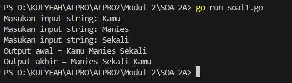
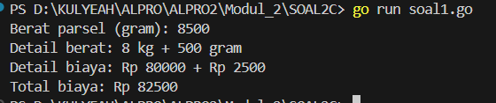
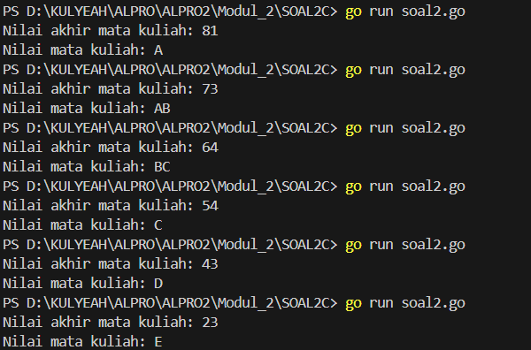

<h1 align="center">Laporan Praktikum Modul 2 <br>Review Pengenalan Pemrograman</h1>
<p align="center">SYAHLA KHEISYA MAYASTRIA - 103112430018</p>

## Dasar Teori
Bahasa Go (Golang) adalah bahasa pemrograman yang dikembangkan oleh Google, dirancang untuk sederhana, cepat, dan mendukung pemrograman paralel. Go memiliki sintaks minimalis dengan tipe data statis seperti `int`, `float64`, `string`, dan `bool`. Setiap program Go dimulai dengan `package main` dan fungsi utama `func main()`. Variabel dapat dideklarasikan menggunakan kata kunci `var` atau cara cepat dengan `:=`. Percabangan menggunakan `if-else`, sementara perulangan menggunakan `for`. Go juga mendukung fungsi untuk membagi kode menjadi modul yang lebih kecil dan memiliki fitur `goroutine` untuk menjalankan banyak tugas secara bersamaan. Dengan manajemen memori otomatis dan performa tinggi, Go cocok digunakan dalam pengembangan aplikasi backend, sistem cloud, dan layanan berskala besar.
## Unguided

### Soal Latihan 2A

#### Soal 1

> Telusuri program berikut dengan cara mengkompilasi dan mengeksekusi program. Silakan masukan data yang sesuai sebanyak yang diminta program. Perhatikan keluaran yang diperoleh. Coba terangkan apa sebenarnya yang dilakukan program tersebut?

```go
package main
import "fmt"

func main() {

    var (
        satu, dua, tiga string
        temp string
    )

    fmt.Print("Masukan input string: ")
    fmt.Scanln(&satu)
    fmt.Print("Masukan input string: ")
    fmt.Scanln(&dua)
    fmt.Print("Masukan input string: ")
    fmt.Scanln(&tiga)
    fmt.Println("Output awal = " + satu + " " + dua + " " + tiga)

    temp = satu
    satu = dua
    dua = tiga
    tiga = temp

    fmt.Println("Output akhir = " + satu + " " + dua + " " + tiga)
}
```


Program ini digunakan untuk menerima tiga inputan string dari user, lalu menukar posisinya sebelum mencetak hasil akhir. Setelah menerima input, program menampilkan urutan awal string. Kemudian, nilai `satu` dipindahkan ke `dua`, `dua` ke `tiga`, dan `tiga` ke `satu` menggunakan variabel sementara (`temp`). Akhirnya, program mencetak urutan string yang telah ditukar.
#### Soal 2

>Tahun kabisat adalah tahun yang habis dibagi 400 atau habis dibagi 4 tetapi tidak habis dibagi 100. Buatlah sebuah program yang menerima input sebuah bilangan bulat dan memeriksa apakah bilangan tersebut merupakan tahun kabisat (true) atau bukan (false).
```go
package main
import "fmt"

func main() {
    var tahun int
    var kabisat bool

    fmt.Scanln(&tahun)

    if tahun%400 == 0 || tahun%4 == 0 && tahun%100 != 0 {
        kabisat = true
    } else {
        kabisat = false
    }

    fmt.Println("Tahun:", tahun)
    fmt.Println("Kabisat:", kabisat)
}
```

Program yang berfungsi untuk menentukan apakah suatu tahun merupakan tahun kabisat atau bukan.
Deklarasikan variabel `tahun` untuk menyimpan input dari pengguna dan variabel kabisat untuk menyimpan hasil pengecekan. Setelah pengguna memasukkan tahun, program melakukan pengecekan menggunakan pernyataan if-else berdasarkan aturan tahun kabisat:
- Jika tahun habis dibagi 400 (`tahun%400 == 0`), maka tahun tersebut kabisat.
- Jika tahun habis dibagi 4 (`tahun%4 == 0`) tetapi tidak habis dibagi 100 (`tahun%100 != 0`), maka juga kabisat.
- Selain itu, tahun dianggap bukan kabisat.
Lalu hasilnya disimpan dalam variabel kabisat sebagai nilai true atau false, kemudian program mencetak tahun yang dimasukkan dan statusnya sebagai tahun kabisat atau tidak.
#### Soal 3

>Buat program Bola yang menerima input jari-jari suatu bola (bilangan bulat). Tampilkan Volume dan Luas kulit bola. 𝑣𝑜𝑙𝑢𝑚𝑒𝑏𝑜𝑙𝑎= 𝜋𝑟 dan 𝑙𝑢𝑎𝑠𝑏𝑜𝑙𝑎=4𝜋𝑟 (π ≈ 3.1415926535).
>
```go
package main
import "fmt"

func main() {
    var tahun int
    var kabisat bool
    fmt.Scanln(&tahun)

    if tahun%400 == 0 || tahun%4 == 0 && tahun%100 != 0 {
        kabisat = true
    } else {
        kabisat = false
    }

    fmt.Println("Tahun:", tahun)
    fmt.Println("Kabisat:", kabisat)
}
```

Program ini menghitung volume dan luas permukaan bola berdasarkan jejari (radius) yang dimasukkan oleh pengguna. Setelah menerima input jejari, program menetapkan nilai π (phi) sebagai 3.1415926535 untuk perhitungan yang lebih akurat. Volume bola dihitung menggunakan rumus V = (4/3) * π * r³, sedangkan luas permukaan bola dihitung dengan rumus A = 4 * π * r². Karena jejari yang dimasukkan bertipe `int`, program mengonversinya ke float64 untuk memastikan hasil perhitungan lebih presisi. Hasil akhirnya ditampilkan dengan format 4 angka di belakang koma, mencantumkan nilai jejari, volume, dan luas permukaan bola.

#### Soal 4

>Dibaca nilai temperatur dalam derajat Celsius. Nyatakan temperatur tersebut dalam Fahrenheit c𝑒𝑙𝑠𝑖𝑢𝑠=(𝐹𝑎ℎ𝑟𝑒𝑛ℎ𝑒𝑖𝑡−32)×5 9 𝑅𝑒𝑎𝑚𝑢𝑟=𝐶𝑒𝑙𝑐𝑖𝑢𝑠×4 5 𝐾𝑒𝑙𝑣𝑖𝑛=(𝐹𝑎ℎ𝑟𝑒𝑛ℎ𝑒𝑖𝑡+459.67)×5 9. Lanjutkan program di atas, sehingga temperatur dinyatakan juga dalam derajat Reamur dan Kelvin.
```go
package main
import "fmt"

func main() {
    var celcius, reamur, fahrenheit int
    var kelvin float32

    fmt.Print("Temperatur Celcius: ")
    fmt.Scanln(&celcius)

    reamur = celcius * 4 / 5
    fahrenheit = celcius*9/5 + 32
    kelvin = (float32(fahrenheit) + 459.67) * 5 / 9

    fmt.Println("Derajat Reamur:", reamur)
    fmt.Println("Derajat Fahrenheit:", fahrenheit)
    fmt.Println("Derajat Kelvin:", int(kelvin))
}
```

Program ini mengonversi suhu dari derajat **Celcius** ke **Reamur, Fahrenheit,** dan **Kelvin**. Setelah pengguna memasukkan suhu dalam Celcius, program menghitung konversinya menggunakan rumus:
- Reamur = Celcius × 4/5
- Fahrenheit = (Celcius × 9/5) + 32
- Kelvin = ((Fahrenheit + 459.67) × 5/9)
Hasil konversi Reamur dan Fahrenheit disimpan dalam variabel bertipe int, sedangkan Kelvin menggunakan float32 untuk menjaga akurasi perhitungan sebelum akhirnya dikonversi kembali ke int saat ditampilkan. Program kemudian mencetak hasil konversi dalam tiga satuan suhu tersebut.
#### Soal 5
>Tipe karakter sebenarnya hanya apa yang tampak dalam tampilan. Di dalamnya tersimpan dalam bentuk biner 8 bit (byte) atau 32 bit (rune) saja. Buat program ASCII yang akan membaca 5 buat data integer dan mencetaknya dalam format karakter. Kemudian membaca 3 buah data karakter dan mencetak 3 buah karakter setelah karakter tersebut (menurut tabel ASCII) Masukan terdiri dari dua baris. Baris pertama berisi 5 buah data integer. Data integer mempunyai nilai antara 32 s.d. 127. Baris kedua berisi 3 buah karakter yang berdampingan satu dengan yang lain (tanpa dipisahkan spasi). Keluaran juga terdiri dari dua baris. Baris pertama berisi 5 buah representasi karakter dari data yang diberikan, yang berdampingan satu dengan lain, tanpa dipisahkan spasi. Baris kedua berisi 3 buah karakter (juga tidak dipisahkan oleh spasi).

```go
package main
import "fmt"

func main() {
    var k1, k2, k3, k4, k5 int
    var h1, h2, h3 rune
    fmt.Scan(&k1, &k2, &k3, &k4, &k5)
    fmt.Scanln()
    fmt.Scanf("%c%c%c\n", &h1, &h2, &h3)

    h1 += 1
    h2 += 1
    h3 += 1
  
    fmt.Printf("%c%c%c%c%c\n", k1, k2, k3, k4, k5)
    fmt.Printf("%c%c%c\n", h1, h2, h3)
}
```


Program ini membaca lima angka dan tiga karakter dari input pengguna, lalu memodifikasi serta mencetak hasilnya.
Pertama, lima angka dibaca dan disimpan dalam variabel k1, k2, k3, k4,` dan `k5, sementara tiga karakter disimpan dalam h1, h2,` dan `h3. Setelah membaca input, program menambahkan **1** ke masing-masing karakter (h1, h2, h3), sehingga nilai ASCII-nya meningkat dan menghasilkan karakter baru.
Terakhir, program mencetak kembali lima angka dalam bentuk karakter serta tiga karakter yang telah dimodifikasi. Output akhir akan menampilkan karakter yang sesuai dengan kode ASCII dari angka pertama dan hasil pergeseran karakter yang telah ditambah satu.

### Soal Latihan 2B

#### Soal 1

> Siswa kelas IPA di salah satu sekolah menengah atas di Indonesia sedang mengadakan praktikum kimia. Di setiap percobaan akan menggunakan 4 tabung reaksi, yang mana susunan warna cairan di setiap tabung akan menentukan hasil percobaan. Siswa diminta untuk mencatat hasil percobaan tersebut. Percobaan dikatakan berhasil apabila susunan warna zat cair pada gelas 1 hingga gelas 4 secara berturutan adalah ‘merah’, ‘kuning’, ‘hijau’, dan ‘ungu’ selama 5 kali percobaan berulang. Buatlah sebuah program yang menerima input berupa warna dari ke 4 gelas reaksi sebanyak 5 kali percobaan. Kemudian program akan menampilkan true apabila urutan warna sesuai dengan informasi yang diberikan pada paragraf sebelumnya, dan false untuk urutan warna lainnya.

```go
package main
import "fmt"

func main() {
    var gelas1, gelas2, gelas3, gelas4 string
    var berhasil bool

    berhasil = true

    for i := 1; i <= 5; i++ {
        fmt.Print("Percobaan ", i, ": ")
        fmt.Scan(&gelas1, &gelas2, &gelas3, &gelas4)
        if !(gelas1 == "merah" && gelas2 == "kuning" && gelas3 == "hijau" && gelas4 == "ungu") {
            berhasil = false
        }
    }

    fmt.Print("Berhasil: ", berhasil)
}
```


Program ini mengevaluasi keberhasilan percobaan berdasarkan urutan warna yang dimasukkan pengguna dalam lima kali percobaan.
Pada setiap percobaan, pengguna memasukkan empat warna ke dalam variabel g1, g2, g3, dan g4. Jika urutan warna merah, kuning, hijau, ungu tidak terpenuhi pada salah satu percobaan, maka variabel berhasil diubah menjadi false.
Setelah lima percobaan selesai, program mencetak status keberhasilan (`true` jika semua percobaan berhasil, atau false jika ada yang gagal).
#### Soal 2

> Suatu pita (string) berisi kumpulan nama-nama bunga yang dipisahkan oleh spasi dan ‘– ‘, contoh pita diilustrasikan seperti berikut ini. Pita: mawar – melati – tulip – teratai – kamboja – anggrek Buatlah sebuah program yang menerima input sebuah bilangan bulat positif (dan tidak nol) N, kemudian program akan meminta input berupa nama bunga secara berulang sebanyak N kali dan nama tersebut disimpan ke dalam pita. (Petunjuk: gunakan operasi penggabungan string dengan operator “+” ). Tampilkan isi pita setelah proses input selesai.

```go
package main
import "fmt"

func main() {
    var bunga, pita string
    var jumlah int

    jumlah = 0
  
    for {
        fmt.Print("Bunga ", jumlah+1, ": ")
        fmt.Scan(&bunga)
        if bunga == "selesai" {
            break
        }
        pita = pita + bunga + " - "
        jumlah++
    }
    fmt.Println("Pita:", pita)
    fmt.Println("Bunga:", jumlah)
}
```


Program ini berfungsi untuk mencatat nama bunga yang dimasukkan oleh pengguna dan menyusunnya dalam sebuah pita teks hingga pengguna memasukkan kata "selesai"
Pada awalnya, variabel jumlah disetel ke 0untuk menghitung jumlah bunga yang dimasukkan. Program menggunakan perulangan infinite loop (for {}) untuk terus meminta input bunga. Setiap kali pengguna memasukkan nama bunga, program menambahkan nama tersebut ke dalam variabel pita dengan format "bunga1 - bunga2 - bunga3 - ..." dan meningkatkan nilai jumlah sebanyak 1
Jika pengguna mengetik "selesai", perulangan dihentikan menggunakan break, lalu program mencetak daftar bunga dalam pita dan total jumlah bunga yang telah dimasukkan.

#### Soal 3

> Setiap hari Pak Andi membawa banyak barang belanjaan dari pasar dengan mengendarai sepeda motor. Barang belanjaan tersebut dibawa dalam kantong terpal di kiri-kanan motor. Sepeda motor tidak akan oleng jika selisih berat barang di kedua kantong sisi tidak lebih dari 9 kg. Buatlah program Pak Andi yang menerima input dua buah bilangan real positif yang menyatakan berat total masing-masing isi kantong terpal. Program akan terus meminta input bilangan tersebut hingga salah satu kantong terpal berisi 9 kg atau lebih.

```go
package main
import "fmt"

func main() {
    var ktg1, ktg2, selisih float32
    var oleng bool

    for {
        fmt.Print("Masukan berat belanjaan di kedua kantong: ")
        fmt.Scan(&ktg1, &ktg2)

        if ktg1 < 0 || ktg2 < 0 {
            fmt.Println("Proses selesai")
            break
        }
        if ktg1+ktg2 > 150 {
            fmt.Println("Proses selesai")
            break
        }
        if ktg1 > ktg2 {
            selisih = ktg1 - ktg2
        } else {
            selisih = ktg2 - ktg1
        }

        oleng = selisih >= 9
        fmt.Println("Sepeda motor pak Andi akan oleng:", oleng)
    }
}
```


Program ini mengevaluasi keseimbangan sepeda motor Pak Andi berdasarkan berat belanjaan di dua kantong. Pengguna memasukkan berat masing-masing kantong secara berulang. Jika berat total melebihi 150 kg atau ada nilai negatif, program berhenti.
Selisih berat dihitung, dan jika perbedaannya 9 kg atau lebih, variabel oleng menjadi true, menandakan motor akan oleng. Program terus meminta input hingga kondisi berhenti terpenuhi.

#### Soal 4
> Diberikan sebuah persamaan sebagai berikut ini. 𝑓(𝑘) = (4𝑘 + 2) 2 (4𝑘 + 1)(4𝑘 + 3) Buatlah sebuah program yang menerima input sebuah bilangan sebagai K, kemudian menghitung dan menampilkan nilai f(K) sesuai persamaan di atas.

```go
package main  
import (
    "fmt"
    "math"
) 

func main() {
    var k int
    fmt.Print("Nilai K: ")
    fmt.Scan(&k)

    result := 1.0

    for i := 0; i < k; i++ {
        numerator := math.Pow(float64(4*i+2), 2)
        denumerator := float64((4*i + 1) * (4*i + 3))
        result *= numerator / denumerator
    }
    fmt.Printf("Hasil dari operasi fungsi = %.10f\n", result)

}
```


Program ini menghitung hasil dari sebuah operasi matematika berdasarkan nilai **K** yang dimasukkan pengguna.
Perhitungan dilakukan dalam perulangan sebanyak K kali, di mana setiap iterasi mengalikan hasil sebelumnya (result) dengan rasio antara pangkat dua dari (4i + 2) dan hasil kali (4i + 1) × (4i + 3) Program menggunakan math.Pow() untuk operasi perpangkatan dan mencetak hasil akhir dengan presisi 10 angka di belakang koma.

### Soal Latihan 2C

#### Soal 1

> PT POS membutuhkan aplikasi perhitungan biaya kirim berdasarkan berat parsel. Maka, buatlah program BiayaPos untuk menghitung biaya pengiriman tersebut dengan ketentuan sebagai berikut! Dari berat parsel (dalam gram), harus dihitung total berat dalam kg dan sisanya (dalam gram). Biaya jasa pengiriman adalah Rp. 10.000,- per kg. Jika sisa berat tidak kurang dari 500 gram, maka tambahan biaya kirim hanya Rp. 5,- per gram saja. Tetapi jika kurang dari 500 gram, maka tambahan biaya akan dibebankan sebesar Rp. 15,- per gram. Sisa berat (yang kurang dari 1kg) digratiskan biayanya apabila total berat ternyata lebih dari 10kg.

```go
package main
import "fmt"

func main() {
    var berat, kg, gram, harga int
    fmt.Print("Berat parsel (gram): ")
    fmt.Scanln(&berat)
    
    kg = berat / 1000
    gram = berat % 1000
  
    fmt.Println("Detail berat:", kg, "kg", "+", gram, "gram")
    if gram >= 500 {
        gram = gram * 5
    } else {
        gram = gram * 15
    }
    if kg < 10 {
        kg = kg * 10000
        harga = kg + gram
    } else {
        kg = kg * 10000
        harga = kg
    }
  
    fmt.Println("Detail biaya: Rp", kg, "+ Rp", gram)
    fmt.Println("Total biaya: Rp", harga)
}
```


Program ini menghitung biaya pengiriman parsel berdasarkan berat yang dimasukkan pengguna dalam gram.
Berat dikonversi ke kilogram (kg) dan gram sisa. Jika gram ≥ 500, biayanya Rp 5 per gram, sedangkan jika < 500, biayanya Rp 15 per gram.
Biaya utama dihitung dari kilogram, di mana setiap kg dikenai Rp 10.000. Jika berat ≥ 10 kg, biaya hanya dihitung dari kg tanpa tambahan biaya gram. Program kemudian mencetak rincian berat dan total biaya pengiriman.

#### Soal 2

> Jawablah pertanyaan-pertanyaan berikut: 
> a. Jika nam diberikan adalah 80.1, apa keluaran dari program tersebut? Apakah eksekusi program tersebut sesuai spesifikasi soal? 
> b. Apa saja kesalahan dari program tersebut? Mengapa demikian? Jelaskan alur program seharusnya! 
> c. Perbaiki program tersebut! Ujilah dengan masukan: 93.5; 70.6; dan 49.5. Seharusnya keluaran yang diperoleh adalah ‘A’, ‘B’, dan ‘D’.

##### Kode Awal
```go
package main
import “fmt”
func main() {
 var nam float64
 var nmk string
 fmt.Print(“Nilai akhir mata kuliah: “)
 fmt.Scanln(&nam)
 if nam > 80 {
 nam = “A”
 }
 if nam > 72.5 {
 nam = “AB”
 }
 if nam > 65 {
 nam = “B”
 }
 if nam > 57.5 {
 nam = “BC”
 }
 if nam > 50 {
 nam = “C”
 }
 if nam > 40 {
 nam = “D”
 } else if nam <= 40 {
 nam = “E”
 }
 fmt.Println(“Nilai mata kuliah: “, nmk)
}
```

##### Kode Setelah di Perbaiki
```go
package main
import "fmt"

func main() {
    var nam float64
    var nmk string
    fmt.Print("Nilai akhir mata kuliah: ")
    fmt.Scanln(&nam)

    if nam > 80 {
        nmk = "A"
    } else if nam > 72.5 && nam <= 80 {
        nmk = "AB"
    } else if nam > 65 && nam <= 72.5 {
        nmk = "B"
    } else if nam > 57.5 && nam <= 65 {
        nmk = "BC"
    } else if nam > 50 && nam <= 57.5 {
        nmk = "C"
    } else if nam > 40 && nam <= 50 {
        nmk = "D"
    } else if nam <= 40 {
        nmk = "E"
    }
    fmt.Println("Nilai mata kuliah:", nmk)
}
```


a. Tidak sesuai karena ada beberapa kesalahan pada program.
b. Kode pertama memiliki banyak kesalahan sintaksis:
	-Penggunaan tanda kutip miring (“dan”) harus diganti dengan kutip netral ("). 
    - nam bertipe float64, tetapi program mencoba menyimpan string ("A", "AB", dll.) ke dalamnya.
    - nam bertipe float64, tetapi program mencoba menyimpan string ("A", "AB", dll.) ke dalamnya.
    - Variabel nmk dideklarasikan tetapi tidak digunakan.
    - Tidak ada penggunaan else if, sehingga semua kondisi tetap dievaluasi.
c. Program sudah sesuai, karena sudah di perbaiki

#### Soal 3

> Sebuah bilangan bulat b memiliki faktor bilangan f > 0 jika f habis membagi b. Contoh: 2 merupakan faktor dari bilangan 6 karena 6 habis dibagi 2. Buatlah program yang menerima input sebuah bilangan bulat b dan b > 1. Program harus dapat mencari dan menampilkan semua faktor dari bilangan tersebut!
> Bilangan bulat b > 0 merupakan bilangan prima p jika dan hanya jika memiliki persis dua faktor bilangan saja, yaitu 1 dan dirinya sendiri. Lanjutkan program sebelumnya. Setelah menerima masukan sebuah bilangan bulat b > 0. Program tersebut mencari dan menampilkan semua faktor bilangan tersebut. Kemudian, program menentukan apakah b merupakan bilangan prima.

```go
package main
import "fmt"

func main() {
    var bil, faktor int
    var prima bool
    fmt.Print("Bilangan: ")
    fmt.Scan(&bil)
    fmt.Print("Faktor: ")

    for i := 1; i <= bil; i++ {
        if bil%i == 0 {
            fmt.Print(i, " ")
            faktor++
        }
    }
    fmt.Println()

    if faktor == 2 {
        prima = true
    } else {
        prima = false
    }
    fmt.Println("Prima:", prima)
}
```


Program ini menentukan faktor-faktor dari sebuah bilangan dan mengecek apakah bilangan tersebut adalah bilangan prima.
Pengguna memasukkan sebuah bilangan, lalu program mencari dan mencetak semua faktor dari bilangan tersebut dengan perulangan dari 1 hingga bilangan itu sendiri. Setiap kali ditemukan faktor, jumlahnya dihitung.
Setelah itu, program mengevaluasi apakah bilangan tersebut hanya memiliki 2 faktor (1 dan dirinya sendiri). Jika iya, maka bilangan dianggap prima (true), jika tidak, maka bukan prima (false). Hasil akhirnya ditampilkan ke layar.

