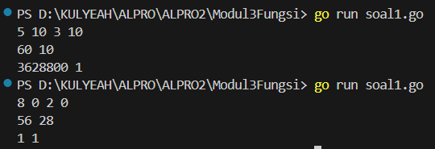
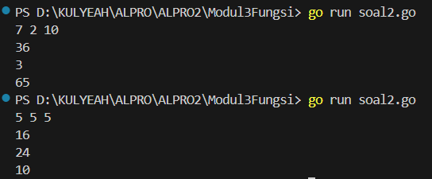
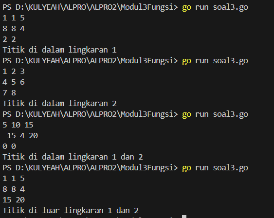

<h1 align="center">Laporan Praktikum Modul 3 <br>Fungsi</h1>
<p align="center">SYAHLA KHEISYA MAYASTRIA - 103112430018</p>

## Dasar Teori
Dalam pemrograman Golang, **fungsi (function)** adalah blok kode yang dapat dipanggil untuk menjalankan tugas tertentu. Fungsi digunakan untuk **mengorganisir kode agar lebih modular, reusable, dan lebih mudah dipahami**.
Fungsi di Go dideklarasikan menggunakan kata kunci func, diikuti oleh:
- **Nama fungsi**, yang digunakan untuk memanggil fungsi.
- **Parameter (opsional)**, sebagai input yang digunakan oleh fungsi.
- **Tipe data return (opsional)**, jika fungsi mengembalikan nilai.
- **Blok kode `{}`**, yang berisi perintah yang akan dieksekusi ketika fungsi dipanggil.
## Unguided

### Soal Latihan Modul 3 Fungsi

#### Soal 1

> Minggu ini, mahasiswa Fakultas Informatika mendapatkan tugas dari mata kuliah matematika diskrit untuk mempelajari kombinasi dan permutasi. Jonas salah seorang mahasiswa, iseng untuk mengimplementasikannya ke dalam suatu program. Oleh karena itu bersediakah kalian membantu Jonas? (tidak tentunya ya :p)
> Masukan terdiri dari empat buah bilangan asli 𝑎, 𝑏, 𝑐, dan 𝑑 yang dipisahkan oleh spasi, dengan syarat 𝑎 ≥ 𝑐 dan 𝑏 ≥ 𝑑. Keluaran terdiri dari dua baris. Baris pertama adalah hasil permutasi dan kombinasi 𝒂 terhadap 𝑐, sedangkan baris kedua adalah hasil permutasi dan kombinasi 𝑏 terhadap 𝑑. 

```go
package main

import (
    "fmt"
    "math/big"
)

func faktorial(n int) *big.Int {
    result := big.NewInt(1)
    for i := 2; i <= n; i++ {
        result.Mul(result, big.NewInt(int64(i)))
    }
    return result
} 

func permutasi(n, r int) *big.Int {
    if n < r {
        return big.NewInt(0)
    }
    return new(big.Int).Div(faktorial(n), faktorial(n-r))
} 

func kombinasi(n, r int) *big.Int {
    if n < r {
        return big.NewInt(0)
    }
    return new(big.Int).Div(permutasi(n, r), faktorial(r))
}

func main() {
    var a, b, c, d int
    fmt.Scan(&a, &b, &c, &d)
    if a >= c && b >= d {
        fmt.Println(permutasi(a, c), kombinasi(a, c))
        fmt.Println(permutasi(b, d), kombinasi(b, d))
    } else {
        fmt.Println("Syarat tidak terpenuhi: pastikan a >= c dan b >= d")
    }
}
```


Program ini digunakan untuk menghitung permutasi dan kombinasi dari dua pasang angka yang diinputkan oleh pengguna. Program ini akan menerima empat angka, menampilkan nilai awal, lalu menghitung permutasi dan kombinasi menggunakan operasi faktorial.
#### Soal 2

>Diberikan tiga buah fungsi matematika yaitu 𝑓 (𝑥) = 𝑥^2 , 𝑔 (𝑥) = 𝑥 − 2 dan ℎ (𝑥) = 𝑥 + 1. Fungsi komposisi (𝑓𝑜𝑔𝑜ℎ)(𝑥) artinya adalah 𝑓(𝑔(ℎ(𝑥))). Tuliskan 𝑓(𝑥), 𝑔(𝑥) dan ℎ(𝑥) dalam bentuk function. Masukan terdiri dari sebuah bilangan bulat 𝑎, 𝑏 dan 𝑐 yang dipisahkan oleh spasi. Keluaran terdiri dari tiga baris. Baris pertama adalah (𝑓𝑜𝑔𝑜ℎ)(𝑎), baris kedua (𝑔𝑜ℎ𝑜𝑓)(𝑏), dan baris ketiga adalah (ℎ𝑜𝑓𝑜𝑔)(𝑐)!
```go
package main
import "fmt"
  
func f(x int) int {
    return x * x
} 

func g(x int) int {
    return x - 2
}
  
func h(x int) int {
    return x + 1
}

func fgh(x int) int {
    return f(g(h(x)))
} 

func ghf(x int) int {
    return g(h(f(x)))
}
  
func hfg(x int) int {
    return h(f(g(x)))
}
  
func main() {
    var a, b, c int
    fmt.Scan(&a, &b, &c)
  
    fmt.Println(fgh(a))
    fmt.Println(ghf(b))
    fmt.Println(hfg(c))
}
```

Program ini digunakan untuk mengolah angka dengan kombinasi tiga operasi matematika sederhana:
1. Mengkuadratkan angka (fungsi `f(x)`)
2. Mengurangi angka dengan 2 (fungsi `g(x)`)
3. Menambah angka dengan 1 (fungsi `h(x)`)
Program menerima tiga angka dari pengguna, lalu menerapkan berbagai komposisi fungsi untuk mendapatkan hasil akhir.
#### Soal 3

>[Lingkaran] Suatu lingkaran didefinisikan dengan koordinat titik pusat (𝑐𝑥,𝑐𝑦) dengan radius r. Apabila diberikan dua buah lingkaran, maka tentukan posisi sebuah titik sembarang (𝑥,𝑦) berdasarkan dua lingkaran tersebut. Masukan terdiri dari beberapa tiga baris. Baris pertama dan kedua adalah koordinat titik pusat dan radius dari lingkaran 1 dan lingkaran 2, sedangkan baris ketiga adalah koordinat titik sembarang. Asumsi sumbu x dan y dari semua titik dan juga radius direpresentasikan dengan bilangan bulat. Keluaran berupa string yang menyatakan posisi titik "Titik di dalam lingkaran 1 dan 2", "Titik di dalam lingkaran 1", "Titik di dalam lingkaran 2", atau "Titik di luar lingkaran 1 dan 2".
>
```go
package main

import (
    "fmt"
    "math"
)
  
func jarak(x1, y1, x2, y2 int) float64 {
    dx := float64(x1 - x2)
    dy := float64(y1 - y2)
    return math.Sqrt(dx*dx + dy*dy)
}
  
func main() {
    var cx1, cy1, r1, cx2, cy2, r2, x, y int
    fmt.Scan(&cx1, &cy1, &r1, &cx2, &cy2, &r2, &x, &y)

    jarak1 := jarak(x, y, cx1, cy1)
    jarak2 := jarak(x, y, cx2, cy2)
    inside1 := jarak1 <= float64(r1)
    inside2 := jarak2 <= float64(r2)

    if inside1 && inside2 {
        fmt.Println("Titik di dalam lingkaran 1 dan 2")
    } else if inside1 {
        fmt.Println("Titik di dalam lingkaran 1")
    } else if inside2 {
        fmt.Println("Titik di dalam lingkaran 2")
    } else {
        fmt.Println("Titik di luar lingkaran 1 dan 2")
    }
}
```

Program ini digunakan untuk menentukan apakah suatu titik berada di dalam, di luar, atau di dalam salah satu dari dua lingkaran.
- Program menerima input berupa koordinat pusat dan jari-jari dua lingkaran, serta koordinat titik yang diuji.
- Menggunakan rumus jarak Euclidean, program menghitung jarak titik ke masing-masing pusat lingkaran.
- Hasilnya berdasarkan perbandingan jarak dengan jari-jari lingkaran.


