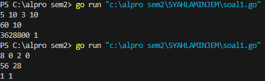
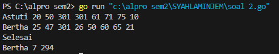
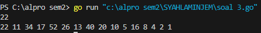

<h1 align="center">Laporan Praktikum Modul 4 <br>Prosedur</h1>
<p align="center">SYAHLA KHEISYA MAYASTRIA - 103112430018</p>

## Dasar Teori
Dalam bahasa pemrograman **Go (Golang)**, **prosedur** adalah bentuk fungsi yang tidak mengembalikan nilai (_void function_). Prosedur digunakan untuk menjalankan serangkaian instruksi tanpa menghasilkan output dalam bentuk nilai yang dapat dikembalikan.
Dalam bahasa lain seperti Pascal atau C, konsep ini dikenal sebagai _procedure_ atau _subroutine_. Namun, dalam Go, prosedur tetap menggunakan kata kunci `func` seperti halnya fungsi pada umumnya, hanya saja tidak memiliki perintah `return`.
- Kata kunci `func` digunakan untuk mendefinisikan prosedur.
- Nama prosedur mengikuti aturan penamaan yang sama dengan fungsi.
- Bisa menerima satu atau lebih parameter sebagai input.
- Tidak memiliki `return`, karena tidak mengembalikan nilai.
## Unguided

### Soal Latihan Modul 4 Prosedur

#### Soal 1

> Minggu ini, mahasiswa Fakultas Informatika mendapatkan tugas dari mata kuliah matematika diskrit untuk mempelajari kombinasi dan permutasi. Jonas salah seorang mahasiswa, iseng untuk mengimplementasikannya ke dalam suatu program. Oleh karena itu bersediakah kalian membantu Jonas? (tidak tentunya ya :p)
> Masukan terdiri dari empat buah bilangan asli 𝑎, 𝑏, 𝑐, dan 𝑑 yang dipisahkan oleh spasi, dengan syarat 𝑎 ≥ 𝑐 dan 𝑏 ≥ 𝑑. Keluaran terdiri dari dua baris. Baris pertama adalah hasil permutasi dan kombinasi 𝒂 terhadap 𝑐, sedangkan baris kedua adalah hasil permutasi dan kombinasi 𝑏 terhadap 𝑑. 

```go
package main

import (
    "fmt"
    "math/big"
)

func faktorial(n int) *big.Int {
    result := big.NewInt(1)
    for i := 2; ![[Pasted image 20250319220732.png]]i <= n; i++ {
        result.Mul(result, big.NewInt(int64(i)))
    }
    return result
} 

func permutasi(n, r int) *big.Int {
    if n < r {
        return big.NewInt(0)
    }
    return new(big.Int).Div(faktorial(n), faktorial(n-r))
} 

func kombinasi(n, r int) *big.Int {
    if n < r {
        return big.NewInt(0)
    }
    return new(big.Int).Div(permutasi(n, r), faktorial(r))
}

func main() {
    var a, b, c, d int
    fmt.Scan(&a, &b, &c, &d)
    if a >= c && b >= d {
        fmt.Println(permutasi(a, c), kombinasi(a, c))
        fmt.Println(permutasi(b, d), kombinasi(b, d))
    } else {
        fmt.Println("Syarat tidak terpenuhi: pastikan a >= c dan b >= d")
    }
}
```


Program ini digunakan untuk menghitung permutasi dan kombinasi dari dua pasang angka yang diinputkan oleh pengguna. Program ini akan menerima empat angka, menampilkan nilai awal, lalu menghitung permutasi dan kombinasi menggunakan operasi faktorial.
#### Soal 2

Kompetisi pemrograman tingkat nasional berlangsung ketat. Setiap peserta diberikan 8 soal  
yang harus dapat diselesaikan dalam waktu 5 jam saja. Peserta yang berhasil menyelesaikan  
soal paling banyak dalam waktu paling singkat adalah pemenangnya.  
Buat program gema yang mencari pemenang dari daftar peserta yang diberikan. Program  
harus dibuat modular, yaitu dengan membuat prosedur hitungSkor yang mengembalikan total  
soal dan total skor yang dikerjakan oleh seorang peserta, melalui parameter formal.  
Pembacaan nama peserta dilakukan di program utama, sedangkan waktu pengerjaan dibaca  
di dalam prosedur. 

prosedure hitungSkor(in/out soal, skor : integer)  
Setiap baris masukan dimulai dengan satu string nama peserta tersebut diikuti dengan adalah  
8 integer yang menyatakan berapa lama (dalam menit) peserta tersebut menyelesaikan soal.  
Jika tidak berhasil atau tidak mengirimkan jawaban maka otomatis dianggap menyelesaikan  
dalam waktu 5 jam 1 menit (301 menit).  
Satu baris keluaran berisi nama pemenang, jumlah soal yang diselesaikan, dan nilai yang  
diperoleh. Nilai adalah total waktu yang dibutuhkan untuk menyelesaikan soal yang berhasil  
diselesaikan.
```go
package main
import "fmt"

func hitungSkor(waktu []int, soal *int, skor *int) {
    *soal = 0
    *skor = 0
    for _, t := range waktu {
        if t < 301 {
            *soal++
            *skor += t
        }
    }
}

func main() {
    var nama string
    var waktu [8]int
    var pemenang string
    var maxSoal, minSkor int
    maxSoal = -1
    minSkor = 999999

    for {
        fmt.Scan(&nama)
        if nama == "Selesai" {
            break
        }

        for i := 0; i < 8; i++ {
            fmt.Scan(&waktu[i])
        }

        var soal, skor int
        hitungSkor(waktu[:], &soal, &skor)

        if soal > maxSoal || (soal == maxSoal && skor < minSkor) {
            pemenang = nama
            maxSoal = soal
            minSkor = skor
        }
    }

    if pemenang != "" {
        fmt.Println(pemenang, maxSoal, minSkor)
    }
}
```

Program ini menentukan pemenang kompetisi pemrograman berdasarkan jumlah soal yang berhasil diselesaikan dan total waktu pengerjaan. Jika soal tidak dikerjakan, dianggap memakan waktu 301 menit. Prosedur `hitungSkor` menghitung jumlah soal yang diselesaikan dan total waktu yang digunakan. Pemenang ditentukan berdasarkan jumlah soal terbanyak, dan jika sama, dipilih yang memiliki waktu pengerjaan lebih sedikit. Program berakhir saat input **"Selesai"** diberikan, lalu menampilkan nama pemenang, jumlah soal yang dikerjakan, dan total waktu pengerjaan. 
#### Soal 3

Skiena dan Revilla dalam Programming Challenges mendefinisikan sebuah deret bilangan.  
Deret dimulai dengan sebuah bilangan bulat n. Jika bilangan n saat itu genap, maka suku  
berikutnya adalah ½n, tetapi jika ganjil maka suku berikutnya bernilai 3n+1. Rumus yang sama  
digunakan terus menerus untuk mencari suku berikutnya. Deret berakhir ketika suku terakhir  
Halaman 9 | M o d u l P r a k t i k u m A l g o r i t m a P e m r o g r a m a n  
bernilai 1. Sebagai contoh jika dimulai dengan n=22, maka deret bilangan yang diperoleh  
adalah: 22 11 34 17 52 26 13 40 20 10 5 16 8 4 2 1  

Untuk suku awal sampai dengan 1000000, diketahui deret selalu mencapai suku dengan nilai 1.  
Buat program skiena yang akan mencetak setiap suku dari deret yang dijelaskan di atas untuk  
nilai suku awal yang diberikan. Pencetakan deret harus dibuat dalam prosedur cetakDeret  
yang mempunyai 1 parameter formal, yaitu nilai dari suku awal.  
prosedure cetakDeret(in n : integer )  
Masukan berupa satu bilangan integer positif yang lebih kecil dari 1000000.  
Keluaran terdiri dari satu baris saja. Setiap suku dari deret tersebut dicetak dalam baris yang  
dan dipisahkan oleh sebuah spasi.
>
```go
package main
import "fmt"

func cetakDeret(n int) {
    for n != 1 {
        fmt.Print(n, " ")
        if n%2 == 0 {
            n /= 2
        } else {
            n = 3*n + 1
        }
    }
    fmt.Println(1)
}

func main() {
    var n int
    fmt.Scan(&n)
    if n > 0 && n < 1000000 {
        cetakDeret(n)
    } else {

        fmt.Println("Masukkan harus bilangan positif kurang dari 1000000")
    }
}
```

- **Fungsi `cetakDeret(n int)`**
    
    - Mencetak nilai `n`, lalu menghitung suku berikutnya sesuai aturan:
        - Jika genap → dibagi 2
        - Jika ganjil → dikalikan 3 dan ditambah 1
    - Berhenti ketika `n == 1`.
- **Program utama (`main`)**
    
    - Membaca input angka **n**.
    - Memeriksa apakah **n valid** (harus lebih dari 0 dan kurang dari 1.000.000).
    - Memanggil fungsi `cetakDeret(n)`.


