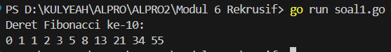
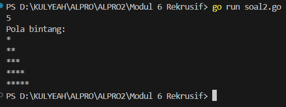
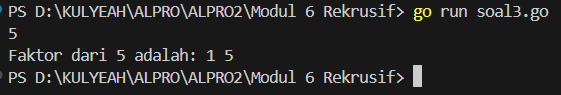
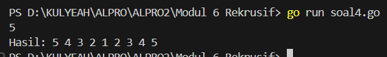
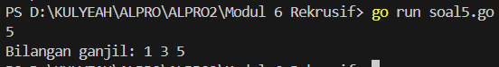
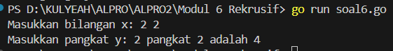

<h1 align="center">Laporan Praktikum Modul 5 <br>Rekursif</h1>
<p align="center">SYAHLA KHEISYA MAYASTRIA - 103112430018</p>

## Dasar Teori
Rekursif adalah teknik dalam pemrograman di mana suatu fungsi memanggil dirinya sendiri secara langsung atau tidak langsung. Fungsi rekursif sering digunakan untuk menyelesaikan masalah yang dapat dipecah menjadi submasalah yang lebih kecil dengan struktur yang serupa.
**Struktur Dasar Fungsi Rekursif di Go**  
Fungsi rekursif harus memiliki dua komponen utama:
- **Base case** (kondisi berhenti) yang mencegah pemanggilan tak terbatas.
- **Recursive case** yang memanggil fungsi itu sendiri dengan parameter yang berbeda
**Kelebihan Rekursif:**
- Mempermudah solusi untuk masalah yang bersifat hierarkis atau berulang.
- Kode lebih ringkas dan mudah dibaca untuk beberapa kasus seperti pohon biner atau Fibonacci.
**Kekurangan Rekursif:**
- Bisa menyebabkan _stack overflow_ jika tidak memiliki base case yang benar.
- Lebih lambat dibandingkan iterasi karena membutuhkan alokasi stack tambahan.
## Unguided

### Soal Latihan Modul 5 Rekursif

#### Soal 1
> Deret fibonacci adalah sebuah deret dengan nilai suku ke-0 dan ke-1 adalah 0 dan 1, dan nilai suku ke-n selanjutnya adalah hasil penjumlahan dua suku sebelumnya. Secara umum dapat diformulasikan 𝑆𝑛 = 𝑆𝑛−1 + 𝑆𝑛−2 . Berikut ini adalah contoh nilai deret fibonacci hingga suku ke-10. Buatlah program yang mengimplementasikan fungsi rekursif pada deret fibonacci tersebut.
```go
package main
import "fmt"
  
func fibonacci(n int) int {
    if n == 0 {
        return 0
    } else if n == 1 {
        return 1
    }
    return fibonacci(n-1) + fibonacci(n-2)
}
  
func main() {
    fmt.Println("Deret Fibonacci ke-10:")
    for i := 0; i <= 10; i++ {
        fmt.Print(fibonacci(i), " ")
    }
    fmt.Println()
}
```


Program ini digunakan untuk menghitung dan menampilkan deret Fibonacci hingga suku ke-10. 
- Program mencetak teks: "Deret Fibonacci hingga suku ke-10:"
- Menggunakan perulangan for untuk menghitung dan mencetak deret Fibonacci dari suku ke-0 hingga ke-10.
- Setiap iterasi, fungsi fibonacci(i) dipanggil untuk menghitung nilai Fibonacci ke-i.
#### Soal 2
Buatlah sebuah program yang digunakan untuk menampilkan pola bintang berikut ini dengan menggunakan fungsi rekursif. N adalah masukan dari user.
```go
package main
import "fmt"

func printStars(n, i int) {
    if i > n {
        return
    }
    fmt.Println(stringRepeat("*", i))
    printStars(n, i+1)
}

func stringRepeat(char string, count int) string {
    if count == 0 {
        return ""
    }
    return char + stringRepeat(char, count-1)
}

func main() {
    var N int
    fmt.Scan(&N)
    fmt.Println("Pola bintang:")
    printStars(N, 1)

}
```

Program ini digunakan untuk menampilkan pola bintang sesuai dengan jumlah baris yang dimasukkan oleh pengguna.
- Fungsi printStars(n int)
    - Fungsi ini bertanggung jawab untuk mencetak N  baris bintang.
    - Base case: Jika n == 0, fungsi berhenti.
    - Sebelum mencetak bintang, fungsi memanggil dirinya sendiri dengan `n-1`, sehingga baris pertama yang dicetak adalah yang terkecil.
- Fungsi stringRepeat(char string, count int) string
    - Fungsi ini digunakan untuk mengulang karakter `'*'` sebanyak `count` kali.
    - Base case: Jika count == 0, kembalikan string kosong.
    - Jika tidak, tambahkan `'*'` satu per satu secara rekursif.
#### Soal 3
Buatlah program yang mengimplementasikan rekursif untuk menampilkan faktor bilangan dari suatu N, atau bilangan yang apa saja yang habis membagi N. 
Masukan terdiri dari sebuah bilangan bulat positif N. 
Keluaran terdiri dari barisan bilangan yang menjadi faktor dari N (terurut dari 1 hingga N ya).
```go
package main
import "fmt"

func printFactors(N, i int) {
    if i > N {
        return
    }
    if N%i == 0 {
        fmt.Print(i, " ")
    }
    printFactors(N, i+1)
}

func main() {
    var N int
    fmt.Scan(&N)  

    fmt.Print("Faktor dari ", N, " adalah: ")
    printFactors(N, 1)
    fmt.Println()
}
```

Program ini digunakan untuk mencari faktor-faktor dari bilangan bulat positif N. Faktor-faktor ini adalah angka yang dapat membagi N tanpa sisa.
Fungsi printFactors(N, i)
- Mencari dan mencetak semua faktor dari N
- Base case: Jika i > N, fungsi berhenti.
- Pengecekan faktor: Jika N % i == 0, maka iadalah faktor N, sehingga dicetak.

#### Soal 4
Buatlah program yang mengimplementasikan rekursif untuk menampilkan barisan bilangan tertentu. 
Masukan terdiri dari sebuah bilangan bulat positif N. 
Keluaran terdiri dari barisan bilangan dari N hingga 1 dan kembali ke N.
```go
package main
import "fmt"

func turun(N int) {
    if N < 1 {
        return
    }
    fmt.Print(N, " ")  
    turun(N - 1)      
}
  
func naik(N, i int) {
    if i > N {
        return
    }
    fmt.Print(i, " ")  
    naik(N, i+1)      
}
  
func main() {
    var N int
    fmt.Scan(&N)
  
    fmt.Print("Hasil: ")
    turun(N)    
    naik(N, 2)  
    fmt.Println()
}
```

Program ini digunakan untuk menampilkan sebuah barisan bilangan yang dimulai dari N ke 1, lalu kembali naik dari 1 ke N
Fungsi turun(N)
    - Mencetak angka dari N hingga `1` secara menurun.
    - Base Case: Jika N < 1, rekursi berhenti.
    - Setelah mencetak angka, fungsi memanggil dirinya sendiri dengan N-1.
Fungsi naik(N, i)
    - Mencetak angka dari 1 hingga N secara menaik.
    - Memulai dari i = 2 agar angka 1 tidak dicetak dua kali.
    - Base Case: Jika i > N, rekursi berhenti.
    - Setelah mencetak angka, fungsi memanggil dirinya sendiri dengan i+1.
#### Soal 5
Buatlah program yang mengimplementasikan rekursif untuk menampilkan barisan bilangan ganjil. Masukan terdiri dari sebuah bilangan bulat positif N. 
Keluaran terdiri dari barisan bilangan ganjil dari 1 hingga N.
```go
package main
import "fmt"
  
func cetakGanjil(i, N int) {
    if i > N {
        return
    }
    fmt.Print(i, " ")
    cetakGanjil(i+2, N)
}
  
func main() {
    var N int
    fmt.Scan(&N)
  
    fmt.Print("Bilangan ganjil: ")
    cetakGanjil(1, N)
    fmt.Println()
}
```

Program ini digunakan untuk menampilkan bilangan ganjil dari 1 hingga N
Fungsi cetakGanjil(i, N)
- Fungsi ini bertugas mencetak bilangan ganjil secara rekursif.
- Base Case: Jika i > N, maka rekursi berhenti.
- Setiap pemanggilan fungsi menambahkan 2 ke i, sehingga hanya mencetak angka ganjil.
#### Soal 6
Buatlah program yang mengimplementasikan rekursif untuk mencari hasil pangkat dari dua buah bilangan. 
Masukan terdiri dari bilangan bulat x dan y. 
Keluaran terdiri dari hasil x dipangkatkan y. Catatan: diperbolehkan menggunakan asterik "*", tapi dilarang menggunakan import "math".`

```go
package main
import "fmt"

func pangkat(x, y int) int {
    if y == 0 {
        return 1
    }
    return x * pangkat(x, y-1)
} 

func main() {
    var x, y int
    fmt.Print("Masukkan bilangan x: ")
    fmt.Scan(&x)
    fmt.Print("Masukkan pangkat y: ")
    fmt.Scan(&y)
    fmt.Printf("%d pangkat %d adalah %d\n", x, y, pangkat(x, y))
}
```

Program ini digunakan untuk menghitung hasil pangkat dari dua bilangan bulat `x^y` (x dipangkatkan y).
Fungsi pangkat(x, y)
- Base Case: Jika y == 0, maka hasilnya adalah 1, karena **setiap bilangan yang dipangkatkan 0 bernilai 1**.
- pangkat(x, y) = x  pangkat(x, y-1), sehingga setiap pemanggilan akan mengalikan `x` dengan hasil pangkat sebelumnya.


