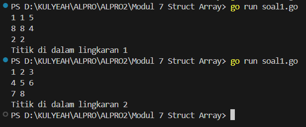
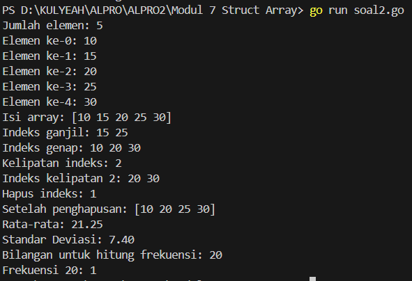
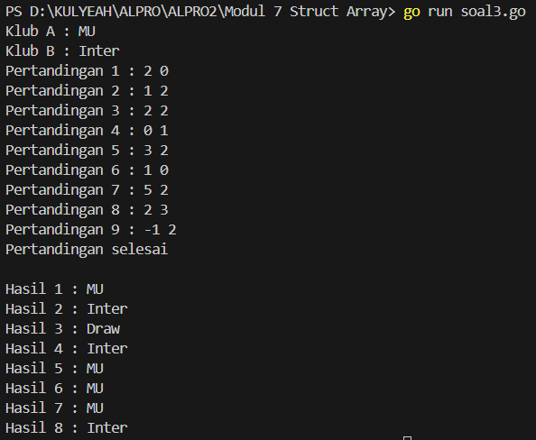
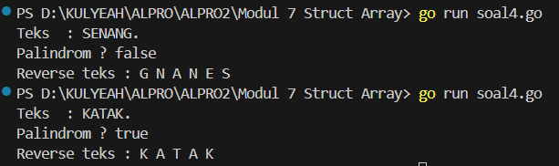

<h1 align="center">Laporan Praktikum Modul 7 <br>Struct Array</h1>
<p align="center">SYAHLA KHEISYA MAYASTRIA - 103112430018</p>

## Dasar Teori
Struct adalah tipe data komposit yang digunakan untuk mengelompokkan berbagai tipe data dalam satu kesatuan. Struct memungkinkan kita membuat objek dengan beberapa atribut, mirip dengan "kelas" pada bahasa pemrograman berorientasi objek. Struct sangat berguna saat kita perlu menyimpan data dengan berbagai tipe dalam satu entitas.
Array adalah tipe data yang menyimpan kumpulan elemen dengan tipe yang sama. Array memiliki ukuran tetap yang harus ditentukan saat deklarasi.
Struct dan array dapat dikombinasikan dalam bentuk **array of struct**. Ini memungkinkan kita menyimpan beberapa objek struct dalam satu array, sehingga cocok digunakan ketika kita ingin mengelola kumpulan data terstruktur dalam jumlah tetap.
## Unguided

### Soal Latihan Modul 7 Struct Array

#### Soal 1
>Suatu lingkaran didefinisikan dengan koordinat titik pusat (𝑐𝑥,𝑐𝑦) dengan radius 𝑟. Apabila diberikan dua buah lingkaran, maka tentukan posisi sebuah titik sembarang (𝑥,𝑦) berdasarkan dua lingkaran tersebut. Gunakan tipe bentukan titik untuk menyimpan koordinat, dan tipe bentukan lingkaran untuk menyimpan titik pusat lingkaran dan radiusnya. Masukan terdiri dari beberapa tiga baris. Baris pertama dan kedua adalah koordinat titik pusat dan radius dari lingkaran 1 dan lingkaran 2, sedangkan baris ketiga adalah koordinat titik sembarang. Asumsi sumbu x dan y dari semua titik dan juga radius direpresentasikan dengan bilangan bulat. Keluaran berupa string yang menyatakan posisi titik "Titik di dalam lingkaran 1 dan 2", "Titik di dalam lingkaran 1", "Titik di dalam lingkaran 2", atau "Titik di luar lingkaran 1 dan 2".
```go
package main

import (
    "fmt"
    "math"
)
  
func jarak(x1, y1, x2, y2 int) float64 {
    dx := float64(x1 - x2)
    dy := float64(y1 - y2)
    return math.Sqrt(dx*dx + dy*dy)
}
  
func main() {
    var cx1, cy1, r1, cx2, cy2, r2, x, y int
    fmt.Scan(&cx1, &cy1, &r1, &cx2, &cy2, &r2, &x, &y)

    jarak1 := jarak(x, y, cx1, cy1)
    jarak2 := jarak(x, y, cx2, cy2)
    inside1 := jarak1 <= float64(r1)
    inside2 := jarak2 <= float64(r2)
  
    if inside1 && inside2 {
        fmt.Println("Titik di dalam lingkaran 1 dan 2")
    } else if inside1 {
        fmt.Println("Titik di dalam lingkaran 1")
    } else if inside2 {
        fmt.Println("Titik di dalam lingkaran 2")
    } else {
        fmt.Println("Titik di luar lingkaran 1 dan 2")
    }
}
```


Program ini digunakan untuk menentukan apakah suatu titik berada di dalam, di luar, atau di dalam salah satu dari dua lingkaran.
- Program menerima input berupa koordinat pusat dan jari-jari dua lingkaran, serta koordinat titik yang diuji.
- Menggunakan rumus jarak Euclidean, program menghitung jarak titik ke masing-masing pusat lingkaran.
- Hasilnya berdasarkan perbandingan jarak dengan jari-jari lingkaran.
#### Soal 2
Sebuah array digunakan untuk menampung sekumpulan bilangan bulat. Buatlah program yang digunakan untuk mengisi array tersebut sebanyak N elemen nilai. Asumsikan array memiliki kapasitas penyimpanan data sejumlah elemen tertentu. Program dapat menampilkan beberapa informasi berikut: 
a. Menampilkan keseluruhan isi dari array. 
b. Menampilkan elemen-elemen array dengan indeks ganjil saja. 
c. Menampilkan elemen-elemen array dengan indeks genap saja (asumsi indek ke-0 adalah genap). 
d. Menampilkan elemen-elemen array dengan indeks kelipatan bilangan x. x bisa diperoleh dari masukan pengguna. 
e. Menghapus elemen array pada indeks tertentu, asumsi indeks yang hapus selalu valid. Tampilkan keseluruhan isi dari arraynya, pastikan data yang dihapus tidak tampil 
f. Menampilkan rata-rata dari bilangan yang ada di dalam array. 
g. Menampilkan standar deviasi atau simpangan baku dari bilangan yang ada di dalam array tersebut.
h. Menampilkan frekuensi dari suatu bilangan tertentu di dalam array yang telah diisi tersebut.
```go
package main  

import (
    "fmt"
    "math"
)

func rataRata(arr []int) float64 {
    var total int
    for _, nilai := range arr {
        total += nilai
    }
    return float64(total) / float64(len(arr))
}
  
func standarDeviasi(arr []int) float64 {
    rata := rataRata(arr)
    var total float64
    for _, nilai := range arr {
        total += math.Pow(float64(nilai)-rata, 2)
    }
    return math.Sqrt(total / float64(len(arr)))
}

func frekuensi(arr []int, x int) int {
    jumlah := 0
    for _, nilai := range arr {
        if nilai == x {
            jumlah++
        }
    }
    return jumlah
}

func main() {
    var n, x, index, target int
    fmt.Print("Jumlah elemen: ")
    fmt.Scan(&n)
    arr := make([]int, n)
  
    for i := 0; i < n; i++ {
        fmt.Printf("Elemen ke-%d: ", i)
        fmt.Scan(&arr[i])
    }
  
    fmt.Println("Isi array:", arr)
    fmt.Print("Indeks ganjil: ")
    for i := 1; i < n; i += 2 {
        fmt.Print(arr[i], " ")
    }
    fmt.Println()

    fmt.Print("Indeks genap: ")
    for i := 0; i < n; i += 2 {
        fmt.Print(arr[i], " ")
    }
    fmt.Println()
    fmt.Print("Kelipatan indeks: ")
    fmt.Scan(&x)
    fmt.Printf("Indeks kelipatan %d: ", x)
    for i := x; i < n; i += x {
        fmt.Print(arr[i], " ")
    }
    fmt.Println()
    fmt.Print("Hapus indeks: ")
    fmt.Scan(&index)
    arr = append(arr[:index], arr[index+1:]...)
    fmt.Println("Setelah penghapusan:", arr)
    fmt.Printf("Rata-rata: %.2f\n", rataRata(arr))
    fmt.Printf("Standar Deviasi: %.2f\n", standarDeviasi(arr))
    fmt.Print("Bilangan untuk hitung frekuensi: ")
    fmt.Scan(&target)
    fmt.Printf("Frekuensi %d: %d\n", target, frekuensi(arr, target))
}
```

Program ini digunakan untuk mengelola dan melakukan operasi pada sebuah array bilangan bulat. Pengguna dapat melakukan beberapa fungsi seperti mengisi array, menampilkan elemen tertentu, menghapus elemen, menghitung rata-rata, standar deviasi, dan menghitung frekuensi bilangan
tertentu.
a. Fungsi rataRata menerima sebuah array integer sebagai parameter. Fungsi ini menghitung jumlah seluruh elemen dan membaginya dengan jumlah elemen untuk mendapatkan rata-rata.
b. Fungsi standarDeviasi menghitung simpangan baku dari elemen array
c. Fungsi frekuensi menghitung berapa kali sebuah bilangan muncul dalam array. Jika ada elemen yang sama dengan bilangan yang dicari, nilai frekuensi akan bertambah.
**Fungsi Utama:**  
a. Input Jumlah Elemen: Program meminta jumlah elemen yang akan disimpan dalam array. Array dibuat menggunakan fungsi make() agar ukurannya sesuai.
b. Mengisi Array: Program melakukan iterasi untuk mengisi array dengan elemen yang dimasukkan pengguna.
c. Menampilkan Isi Array: Program menampilkan seluruh elemen array sekaligus.
d. Menampilkan Elemen dengan Indeks Tertentu:
- Indeks Ganjil: Program mencetak elemen yang berada pada indeks ganjil (1, 3, 5, ...)
- Indeks Genap: Program mencetak elemen yang berada pada indeks genap (0, 2, 4, ...)
- Indeks Kelipatan x: Program meminta pengguna memasukkan nilai x, lalu mencetak elemen pada indeks yang merupakan kelipatan x.
e. Menghapus Elemen pada Indeks Tertentu: Program meminta pengguna memasukkan indeks elemen yang ingin dihapus. Dengan memanfaatkan fungsi append(), elemen pada indeks tersebut akan dihapus tanpa menyisakan nilai kosong.
f. Menghitung Rata-rata: Program menampilkan rata-rata dari seluruh elemen yang ada setelah penghapusan.
g. Menghitung Standar Deviasi:  Setelah menghitung rata-rata, program juga menampilkan simpangan baku dari elemen array.
h. Menghitung Frekuensi Suatu Bilangan:
Program meminta pengguna memasukkan bilangan yang akan dihitung frekuensinya, lalu menampilkan jumlah kemunculannya dalam array.
#### Soal 3
Sebuah program digunakan untuk menyimpan dan menampilkan nama-nama klub yang memenangkan pertandingan bola pada suatu grup pertandingan. Buatlah program yang digunakan untuk merekap skor pertandingan bola 2 buah klub bola yang berlaga. 
Pertama-tama program meminta masukan nama-nama klub yang bertanding, kemudian program meminta masukan skor hasil pertandingan kedua klub tersebut. Yang disimpan dalam array adalah nama-nama klub yang menang saja. 
Proses input skor berhenti ketika skor salah satu atau kedua klub tidak valid (negatif). Di akhir program, tampilkan daftar klub yang memenangkan pertandingan.
```go
package main

import (
    "fmt"
    "math"
)
  
func rataRata(arr []int) float64 {
    total := 0
    for _, nilai := range arr {
        total += nilai
    }
    return float64(total) / float64(len(arr))
} 

func standarDeviasi(arr []int) float64 {
    rata := rataRata(arr)
    total := 0.0
    for _, nilai := range arr {
        sel := float64(nilai) - rata
        total += sel * sel
    }
    return math.Sqrt(total / float64(len(arr)))
}
  
func frekuensi(arr []int, x int) int {
    jumlah := 0
    for _, nilai := range arr {
        if nilai == x {
            jumlah++
        }
    }
    return jumlah
}
  
func main() {
    var klub1, klub2 string
    var skor1, skor2 int
    var pemenang []string
    var hasil []string
    count := 1
  
    fmt.Print("Klub A : ")
    fmt.Scan(&klub1)
    fmt.Print("Klub B : ")
    fmt.Scan(&klub2)
  
    for {
        fmt.Printf("Pertandingan %d : ", count)
        fmt.Scan(&skor1, &skor2)
  
        if skor1 < 0 || skor2 < 0 {
            fmt.Println("Pertandingan selesai")
            break
        }
  
        if skor1 > skor2 {
            pemenang = append(pemenang, klub1)
            hasil = append(hasil, fmt.Sprintf("Hasil %d : %s", count, klub1))
        } else if skor2 > skor1 {
            pemenang = append(pemenang, klub2)
            hasil = append(hasil, fmt.Sprintf("Hasil %d : %s", count, klub2))
        } else {
            hasil = append(hasil, fmt.Sprintf("Hasil %d : Draw", count))
        }
        count++
    }
    fmt.Println()
    for _, h := range hasil {
        fmt.Println(h)
    }
}
```

Program ini digunakan untuk mencatat hasil pertandingan antara dua klub sepak bola yang bertanding dalam beberapa putaran. User akan menginputkan nama kedua klub, kemudian memasukkan skor hasil pertandingan mereka satu per satu.
Program akan:
- Menentukan pemenang dari setiap pertandingan
- Menyimpan nama klub yang menang.
- Menampilkan hasil tiap pertandingan (menang atau draw).
- Menghentikan proses input ketika salah satu skor negatif dimasukkan.
- Menampilkan daftar hasil pertandingan setelah pertandingan selesai.
- Skor dari Klub A dan Klub B dibandingkan:
    - Jika skorA > skorB, maka Klub A menang.
    - Jika skorB > skorA, maka Klub B menang.
    - Jika skorA == skorB, pertandingan dianggap draw (seri).
- Nama klub pemenang disimpan ke dalam array pemenang.
- Ringkasan hasil seperti "Hasil 1 : MU" atau "Hasil 3 : Draw" disimpan dalam array hasil.
#### Soal 4
Buatlah program yang mengimplementasikan rekursif untuk menampilkan barisan bilangan tertentu. 
Masukan terdiri dari sebuah bilangan bulat positif N. 
Keluaran terdiri dari barisan bilangan dari N hingga 1 dan kembali ke N.
```go
package main
import "fmt"

const NMAX int = 127
type tabel [NMAX]rune

func isiArray(t *tabel, n *int) {
    var ch rune
    *n = 0
    fmt.Print("Teks  : ")
    for {
        fmt.Scanf("%c", &ch)
        if ch == '.' || *n >= NMAX {
            break
        }
        t[*n] = ch
        *n++
    }
}
  
func cetakArray(t tabel, n int) {
    fmt.Print("Reverse teks : ")
    for i := 0; i < n; i++ {
        fmt.Printf("%c ", t[i])
    }
    fmt.Println()
}
  
func balikanArray(t *tabel, n int) {
    for i := 0; i < n/2; i++ {
        t[i], t[n-1-i] = t[n-1-i], t[i]
    }
}

func palindrom(t tabel, n int) bool {
    for i := 0; i < n/2; i++ {
        if t[i] != t[n-1-i] {
            return false
        }
    }
    return true
}
  
func main() {
    var tab tabel
    var m int
    isiArray(&tab, &m)
  
    if palindrom(tab, m) {
        fmt.Println("Palindrom ? true")
    } else {
        fmt.Println("Palindrom ? false")
    }
    balikanArray(&tab, m)
    cetakArray(tab, m)
}
```

Program ini digunakan untuk membaca teks karakter satu per satu, membalik urutan teks, dan memeriksa apakah teks tersebut merupakan palindrom.
NMAX: Menyatakan ukuran maksimum array sebanyak 127 karakter.
Fungsi isiArray
- Bertugas mengisi array `t` dengan karakter dari input pengguna.
- Proses berhenti saat pengguna mengetik titik (`.`) atau jumlah karakter melebihi NMAX.
- Nilai n berisi jumlah karakter yang berhasil disimpan.
Fungsi cetakArray
- Mencetak semua karakter di array dari indeks 0 hingga n-1.
- Digunakan untuk menampilkan teks yang telah dibalik.
Fungsi balikanArray
- Menukar posisi elemen array dari ujung ke tengah.
- Digunakan untuk membalik isi teks.
Fungsi palindrom
- Mengecek apakah karakter dalam array adalah palindrom.
- Bandingkan karakter dari awal dengan karakter dari akhir satu per satu.
- Jika ada yang tidak sama, maka bukan palindrom.


